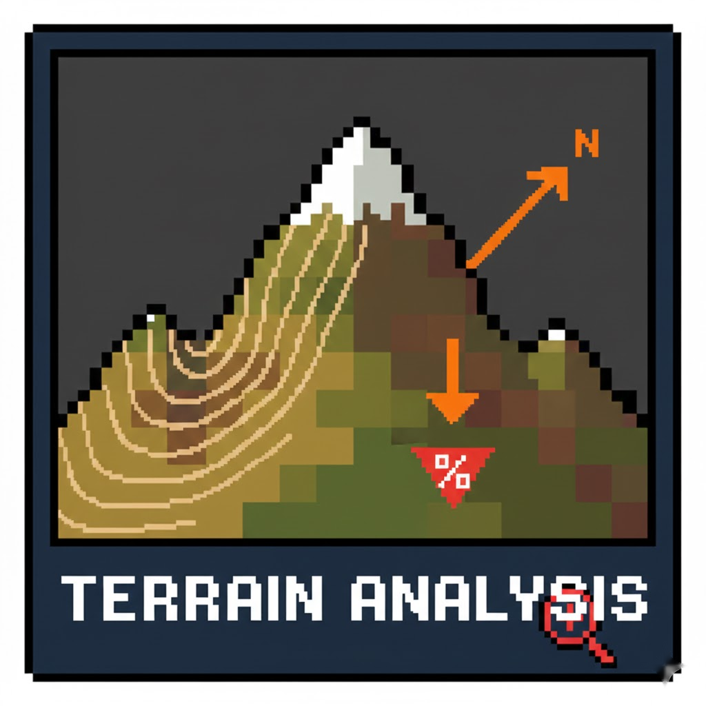
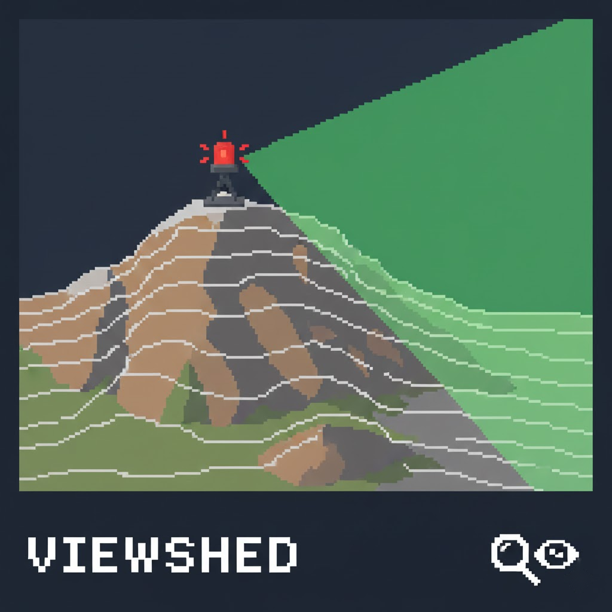
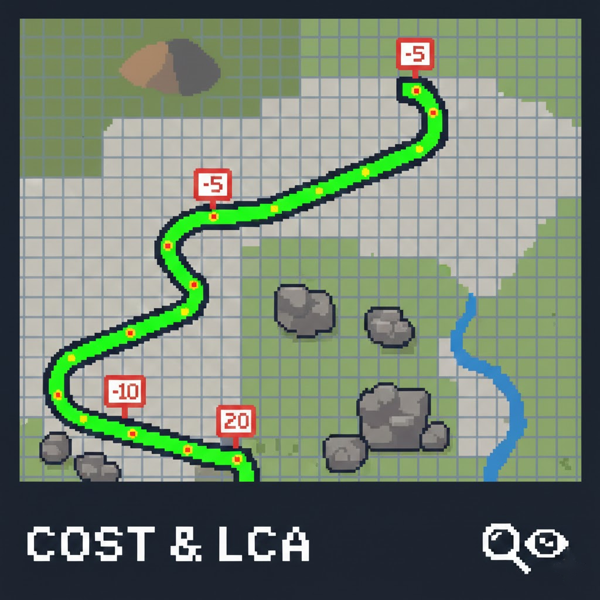

<p align="center">
  
</p>

<h1 align="center">ArchToolkit</h1>

<p align="center">
  <strong>한국의 고고학자·문화유산 연구자를 위한 QGIS 종합 분석 플러그인</strong>
</p>

<p align="center">
  
  
  
  
</p>

<p align="center">
  
  
  
  
</p>

> "지식은 전유물이 아닙니다"

ArchToolkit은 한국의 고고학·문화유산 조사/연구에서 자주 반복되는 작업을 하나의 QGIS 플러그인으로 묶은 도구 상자입니다. DEM 생성부터 지형·가시권·이동·네트워크 분석, 지적도/지질도/지구화학도 보조 처리, 트렌치 후보 제안, 도면화, AOI 기반 AI 요약까지 한 흐름으로 이어집니다.

## ✨ 핵심 포인트

- 🧩 총 18개 도구를 하나의 플러그인 메뉴와 툴바 드롭다운으로 묶었습니다.
- 🇰🇷 한국 실무 맥락에 맞춰 수치지형도 DXF, 지적도, KIGAM 지질도, 지구화학도, 트렌치 후보 제안 보조 기능을 지원합니다.
- 🧱 QGIS 기본 구성 중심으로 설계했습니다. Processing, GDAL, NumPy(QGIS 포함)를 활용하며 GRASS/SAGA/WhiteboxTools 같은 외부 의존성을 기본 요구로 두지 않습니다.
- 🗂 결과 레이어를 가능한 한 `ArchToolkit - ...` 그룹 아래 정리해 프로젝트를 덜 어지럽게 만듭니다.
- 🪵 작업 중 실시간 로그를 확인할 수 있어 긴 연산이나 경고 메시지를 추적하기 쉽습니다.
- 🏷 주요 출력 레이어에 `tool_id`, `run_id`, `kind`, `units`, `params_json` 메타데이터를 붙여 후속 정리와 AI 요약에 활용합니다.
- 🤖 `AI 조사요약 (AOI Report)`는 무료 로컬 요약, Gemini API 기반 보고서 문장 생성, 추가 유적 관계 분석을 지원합니다.

## 🧭 빠른 시작

1. 아래 설치 방법대로 플러그인을 설치하고 QGIS를 다시 시작합니다.
2. `Archaeology Toolkit` 메뉴 또는 `ArchToolkit` 툴바 드롭다운에서 도구를 실행합니다.
3. DEM이 없다면 `DEM 생성` 또는 `등고선 추출`로 기초 지형 데이터를 준비합니다.
4. 연구 목적에 맞게 `지형 분석`, `가시권 분석`, `비용표면/최소비용경로`, `네트워크`, `지질도`, `지구화학도`, `트렌치 후보 제안` 도구를 조합합니다.
5. 결과를 정리하거나 보고서 초안을 만들고 싶다면 `AI 조사요약 (AOI Report)`을 사용합니다.

## 🧰 전체 도구 맵

### 🏗 1. 기초 데이터 / 정리

| 도구 | 핵심 기능 |
| --- | --- |
| `DEM 생성 (Generate DEM)` | 등고선·표고점 기반 DEM 생성, TIN/IDW/Kriging(Lite) 지원, 수치지형도 DXF 코드 프리셋 제공 |
| `등고선 추출 (Extract Contours)` | DXF 레이어 필터링 또는 DEM에서 `gdal_contour` 기반 등고선 생성 |
| `지적도 중첩 면적표 (Cadastral Overlap)` | AOI와 필지 폴리곤의 교차 면적·포함 비율 계산, 중첩 결과 레이어 생성 |

### 🧠 2. 분석

| 도구 | 핵심 기능 |
| --- | --- |
| `지형 분석 (Terrain Analysis)` | 경사, 사면방향, TRI, TPI, Roughness, Slope Position, 곡률(Zevenbergen & Thorne 1987), 사면파생(북향성/동향성/TRASP, Roberts & Cooper 1989) 계산과 분류/스타일·해석 요약 |
| `분석 결과 정렬/내보내기 (Align & Export Stack)` | 이미 만든 분석 결과 래스터들을 하나의 기준 격자(CRS·범위·픽셀크기·NoData)로 정렬해 예측모델용 스택+manifest로 내보내기 (범주형=최근접, 연속형=이중선형) |
| `변수 상관/VIF 리포트 (Correlation & VIF)` | 변수(래스터) 스택의 상관행렬과 VIF(분산팽창계수)를 계산해 예측모델 투입 전 다중공선성 점검, 상관/VIF 리포트·CSV 저장 |
| `AHP 입지적합도 (AHP Suitability)` | 여러 환경 래스터를 AHP 쌍대비교 가중치로 통합해 적합도 래스터 생성 |
| `지구화학도 래스터 수치화 (GeoChem WMS → Raster)` | WMS RGB를 범례 기반으로 역추정해 value/class 래스터와 폴리곤 결과 생성 |
| `지질도 도엽 ZIP 불러오기/래스터 변환 (KIGAM)` | KIGAM 1:50,000 지질도 ZIP 자동 로드, 스타일 적용, 범주형 래스터 변환 |
| `지형 단면 (Terrain Profile)` | 단면선 그리기/저장, 다중 프로파일, 지도-차트 연동, 통계/CSV/이미지 내보내기 |
| `가시권 분석 (Viewshed Analysis)` | 단일·누적·역방향·선형 가시권, LOS 프로파일, AOI 가시 통계, 곡률·굴절 옵션 |
| `비용표면/최소비용경로 (Cost Surface / LCP)` | 경사 기반 이동 시간/에너지 비용표면, LCP, corridor, 추가 마찰, 등시간선/등에너지선 생성 |
| `최소비용 네트워크 (Least-cost Network)` | 유적 간 LCP를 이용한 MST, k-NN, Hub 네트워크와 중심성 지표 생성 |
| `근접/가시성 네트워크 (PPA / Visibility)` | PPA 그래프와 DEM 기반 LOS 가시성 네트워크 생성, 연결성·중심성 분석 지원 |

### 🧭 3. 조사 설계

| 도구 | 핵심 기능 |
| --- | --- |
| `트렌치 후보 제안 (Trench Suggestion)` | AOI 안에서 트렌치 폭·길이·간격 조건을 두고 DEM 방향성, AHP 적합도, 주변 유적/분묘 회피 보조 규칙을 반영해 후보 자동 제안 |

### 🎨 4. 도면화 / 시각화

| 도구 | 핵심 기능 |
| --- | --- |
| `도면 시각화 (Map Styling)` | 한국 수치지형도 DXF 레이어 분류, 도로·하천·건물 스타일, DEM 배경 스타일, QML/프리셋 내보내기 |
| `경사도/사면방향 도면화 (Slope/Aspect Drafting)` | AOI 기준 인쇄용 경사 래스터와 사면방향 화살표 포인트 생성 |

### 🤖 5. AI / 보고

| 도구 | 핵심 기능 |
| --- | --- |
| `AI 조사요약 (AOI Report)` | AOI 반경 내 프로젝트 레이어를 스캔해 로컬 요약 또는 Gemini 기반 보고서 문장 생성, CSV/번들 저장, 추가 유적 관계 분석 지원 |

## 🔍 카테고리별 세부 기능

<details>
<summary><strong>🏗 기초 데이터 · 정리 도구 자세히 보기</strong></summary>

- `DEM 생성`
  - 등고선, 표고점, 3D 포인트 기반 DEM 생성
  - `TIN - Linear`, `TIN - Clough-Tocher`, `IDW`, `Kriging (Lite, Ordinary)` 지원
  - Kriging 사용 시 예측 DEM과 함께 `_variance.tif` 불확실성 래스터도 저장
  - 한국 수치지형도 DXF 코드와 프리셋을 이용해 입력 레이어 선택을 빠르게 보조
- `등고선 추출`
  - DXF 레이어에서 지정 코드만 필터링해 등고선 벡터를 분리
  - DEM에서 일정 간격 등고선을 직접 생성
- `지적도 중첩 면적표`
  - AOI와 필지의 겹침 면적을 계산해 `parcel_m2`, `in_aoi_m2`, `in_aoi_pct` 필드를 채움
  - 조사구역 전체를 하나로 합쳐 계산하거나 AOI 피처 기준으로 결과를 나눠 관리하기 좋음

</details>

<details>
<summary><strong>🧠 분석 도구 자세히 보기</strong></summary>

- `지형 분석`
  - 경사, 사면방향, TRI, TPI, Roughness, Slope Position 계산
  - 분류 기준과 색상 스타일을 함께 적용해 바로 해석 가능한 레이어 생성
- `AHP 입지적합도`
  - 여러 환경 래스터를 0-1로 정규화한 뒤 AHP 가중치로 가중합
  - 평면형 AHP뿐 아니라 상위그룹-하위기준 구조의 계층형 AHP도 지원
  - AOI 범위 자르기와 CR(일관성비율) 확인 가능
- `지형 단면`
  - 단면선 작성, 저장, 재선택, 다중 프로파일 비교
  - 마우스 hover로 차트와 지도 위치를 연동
  - AOI 구간 음영, 오버레이 레이어 표시, CSV/PNG/JPG 내보내기 지원
- `가시권 분석`
  - 단일, 누적, 가중 누적, 역가시권, 선형 가시권, LOS 프로파일 지원
  - Higuchi 거리대, 곡률, 굴절 옵션 제공
  - AOI 가시면적/가시비율 계산과 표준화(0-100%) 가능
- `비용표면/최소비용경로`
  - DEM 경사 기반 이동 비용을 시간 또는 에너지 관점에서 계산
  - Tobler, Naismith, Pandolf, Herzog 계열 등 여러 비용 모델 지원
  - 시작점/도착점 기반 최소비용경로, corridor raster/polygon, 등시간선 생성
  - 추가 마찰을 래스터나 벡터에서 반영 가능
- `최소비용 네트워크`
  - LCP 비용을 바탕으로 `MST`, `k-NN`, `Hub`, `All(MST+k-NN+Hub)` 네트워크 생성
  - 허브값 선택, 허브 간 MST, 가중 중심성 지표 계산 지원
- `근접/가시성 네트워크`
  - PPA는 `k-NN`, `threshold`, `Delaunay`, `Gabriel`, `RNG` 그래프 지원
  - Visibility는 DEM 샘플링 기반 LOS 판정으로 노드 간 가시 연결 생성
  - 연결요소, closeness, betweenness 등 기본 네트워크 지표 계산 가능
- `지구화학도 래스터 수치화`
  - WMS처럼 수치가 아닌 렌더링된 색상 래스터를 범례로 역추정
  - class/value 래스터와 구간별 폴리곤, 중심점 생성 가능
- `KIGAM 지질도 ZIP`
  - 지질도 ZIP 압축 해제, SHP 로드, 스타일/라벨 자동 적용
  - `LITHOIDX`, `AGEIDX` 같은 필드 기반 범주형 래스터 생성
  - 문자 코드는 정수로 매핑하고 `*_mapping.csv`를 함께 저장해 모델링에 활용 가능

</details>

<details>
<summary><strong>🧭 조사 설계 · 도면화 · AI 보고 자세히 보기</strong></summary>

- `트렌치 후보 제안`
  - AOI 안에서 폭, 길이, 개수, 최소 간격, AOI 내부 포함비율 조건을 두고 후보를 자동 생성
  - 기본 방향은 `등고선 직교`, 옵션으로 `등고선 평행`도 지원
  - AHP 적합도 래스터와 주변 유적 레이어를 점수에 반영할 수 있음
  - 무덤/분묘 관련 키워드와 코드 패턴을 이용한 회피 보조 로직 포함
- `도면 시각화`
  - 수치지형도 DXF 레이어를 도로·하천·건물 중심으로 묶어 스타일링
  - DEM 배경에 hillshade, grayscale, color 스타일 적용 가능
  - QML 스타일과 현재 코드 매핑 JSON을 프리셋 폴더로 내보내기 지원
  - DXF 코드 매핑은 `tools/map_styling_codes.json`에서 수정 후 다시 불러오기 가능
- `경사도/사면방향 도면화`
  - AOI 기준으로 출력 범위를 정리한 인쇄용 경사 래스터 생성
  - 방위각 기반 사면방향 화살표 포인트 레이어 생성
- `AI 조사요약`
  - AOI 반경 내 벡터/래스터 레이어를 자동 스캔
  - `무료(로컬 요약)`은 외부 전송 없이 보고서 초안 문장을 생성
  - `Gemini(API)`는 더 자연스러운 문장 생성을 지원하며 키는 QGIS AuthManager에 저장
  - 추가 유적 레이어를 선택해 AOI 내부, AOI 경계 걸침, 버퍼 내부, 버퍼 외부 관계를 함께 요약
  - 대형 폴리곤/선형 유적은 내부/외부 면적 및 길이 비율을 분리해 정리 가능
  - `통계 CSV`, `report.md`, `context.json`, `params.json`, `canvas.png` 번들 저장 지원

</details>

## 🎯 눈여겨볼 기능

- 🧪 `Kriging (Lite, Ordinary)`는 포인트 표고만 있어도 DEM과 분산 래스터를 함께 생성해 불확실성까지 확인할 수 있습니다.
- 🪨 `KIGAM 지질도 ZIP` 도구는 한국 지질도 도엽을 바로 불러오고 범주형 래스터로 바꿔 예측모델 입력으로 이어가기 좋습니다.
- 🧭 `트렌치 후보 제안`은 AOI, DEM, AHP, 주변 유적 맥락을 묶어 조사 설계 초안을 빠르게 잡는 데 도움이 됩니다.
- 🎨 `Map Styling`은 한 번 만든 스타일을 QML과 JSON 프리셋으로 내보낼 수 있어 프로젝트 간 재사용에 유리합니다.
- 🤖 `AI 조사요약`은 ArchToolkit 결과 메타데이터를 읽어 같은 실행에서 나온 레이어를 묶고, 필요하면 추가 유적과의 관계까지 함께 정리하도록 설계되어 있습니다.

## 🗂 출력 정리와 메타데이터

ArchToolkit은 가능한 한 결과를 `ArchToolkit - ...` 그룹 아래에 정리합니다. 예를 들어 AHP, GeoChem, Geology, Terrain Profile, Viewshed, Cost Surface, Network 같은 결과가 도구별 그룹으로 들어가도록 설계되어 있습니다.

주요 결과 레이어에는 다음 custom property를 기록합니다.

- `archtoolkit/tool_id`
- `archtoolkit/run_id`
- `archtoolkit/kind`
- `archtoolkit/units`
- `archtoolkit/params_json`

이 메타데이터는 결과를 정리할 때뿐 아니라 `AI 조사요약`이 의미를 읽고 같은 실행 결과를 묶어 설명할 때도 활용됩니다.

## 🚀 설치

### 요구 사항

- `QGIS 3.40 LTR` 이상
- QGIS `Processing` 프레임워크
- QGIS `GDAL` 프로바이더
- `NumPy`가 포함된 QGIS Python 환경
- 선택 사항: `Gemini API` 키 (`AI 조사요약`의 Gemini 모드에서만 필요)

현재는 QGIS 공식 플러그인 저장소 배포를 준비 중이므로, 당분간은 GitHub 기반 수동 설치를 권장합니다.

### 수동 설치

`ArchToolkit` 폴더명으로 저장소를 아래 QGIS 플러그인 디렉터리에 복사하거나 `git clone`한 뒤 QGIS를 재시작하세요.

```text
Windows: %APPDATA%\QGIS\QGIS3\profiles\default\python\plugins\ArchToolkit
macOS:   ~/Library/Application Support/QGIS/QGIS3/profiles/default/python/plugins/ArchToolkit
Linux:   ~/.local/share/QGIS/QGIS3/profiles/default/python/plugins/ArchToolkit
```

업데이트 방법:

- `git clone`으로 설치했다면 플러그인 폴더에서 `git pull` 후 QGIS 재시작
- ZIP으로 복사했다면 기존 `ArchToolkit` 폴더를 교체한 뒤 QGIS 재시작

## 🤖 AI 조사요약

`AI 조사요약 (AOI Report)`은 분석 결과가 많아졌을 때, AOI 주변에서 무엇이 보이는지 빠르게 문장과 표로 정리하기 위한 도구입니다.

- `무료(로컬 요약)`
  - 외부 전송 없이 이 컴퓨터 안에서 통계를 문장으로 정리합니다.
- `Gemini(API)`
  - AOI 이름, 반경, 레이어 이름, 통계 요약, ArchToolkit 메타데이터를 바탕으로 더 자연스러운 보고서 문장을 생성합니다.
  - API 키는 가능하면 QGIS `AuthManager`에 저장합니다.
- `추가 유적 관계 분석`
  - 별도 유적 레이어를 지정해 AOI 내부/경계/버퍼 관계와 거리 요약을 함께 넣을 수 있습니다.
  - 대형 유적은 내부/외부 면적 또는 길이 비율까지 분리해 정리할 수 있습니다.
- `내보내기`
  - `통계 CSV`: 레이어 요약표와 수치 필드 통계 저장
  - `번들 저장`: `report.md`, `context.json`, `params.json`, CSV, `canvas.png`를 한 폴더에 저장

권장 사용법:

1. AOI 폴리곤을 선택합니다.
2. 반경(m)을 정합니다.
3. 자동/그룹 지정/직접 선택으로 대상 레이어 범위를 조절합니다.
4. 필요하면 추가 유적 관계 분석 옵션을 켭니다.
5. 로컬 요약 또는 Gemini 모드를 선택합니다.
6. 결과를 보고 필요하면 CSV나 번들로 저장합니다.

## ⚠️ 해석 주의

- 가시권, LOS, 비용, 네트워크 결과는 DEM 해상도·CRS·고도 품질에 크게 의존합니다.
- 비용표면과 네트워크는 기본적으로 경사 기반 이동비용 모델입니다. 실제 도로·식생·토지피복은 추가 마찰을 통해 근사적으로 반영합니다.
- GeoChem 도구는 WMS 렌더링 색상을 범례로 역추정하는 방식이므로 원자료 측정값 자체가 아닙니다.
- AHP 적합도는 선택한 기준 레이어, 정규화 범위, 가중치 설정에 따라 달라지는 상대지표입니다.
- 트렌치 후보 제안은 조사 설계 보조 도구이며, 매장문화재 존재를 보장하는 판정 도구가 아닙니다.
- 지적도 결과는 참고용입니다. 법적 효력이나 정확 경계 확인은 관할 기관의 공식 자료를 확인해야 합니다.
- AI 조사요약 결과는 초안/참고용입니다. 최종 해석과 보고서 문장은 사용자가 검토해야 합니다.

## 📚 참고 문서

- [REFERENCES.md](REFERENCES.md): 알고리즘과 학술 참고문헌
- [DEVELOPMENT.md](DEVELOPMENT.md): 외부 의존성 최소화 원칙
- [STABILITY.md](STABILITY.md): 안정화 워크플로우
- [SMOKE_TEST.md](SMOKE_TEST.md): 빠른 스모크 테스트 체크리스트
- [CONTRIBUTING.md](CONTRIBUTING.md): 기여 가이드

## ⭐ Citation & Star
[](https://github.com/lzpxilfe/archtoolkit)
[](https://github.com/lzpxilfe/archtoolkit)

인용 메타데이터는 [CITATION.cff](CITATION.cff)에 보관합니다.


이 플러그인이 유용했다면 GitHub Star를 눌러 주세요. 연구나 실무에서 사용했다면 아래 형태로 인용할 수 있습니다.

```bibtex
@software{ArchToolkit2026,
  author = {lzpxilfe},
  title = {ArchToolkit: Archaeology Toolkit for QGIS},
  year = {2026},
  url = {https://github.com/lzpxilfe/ar},
  version = {0.1.2}
}
```

## 📄 License

`GPL-3.0-or-later`
