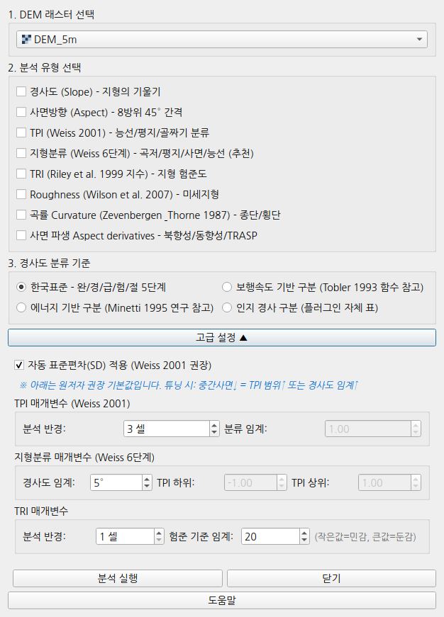
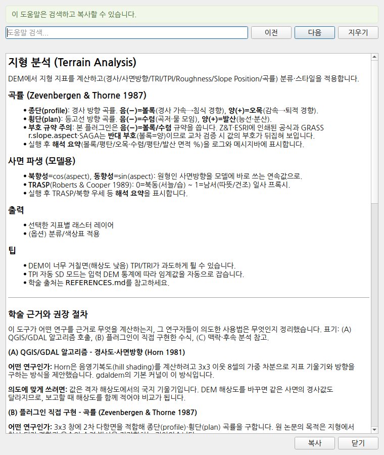
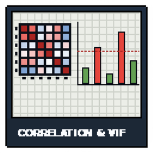
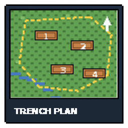
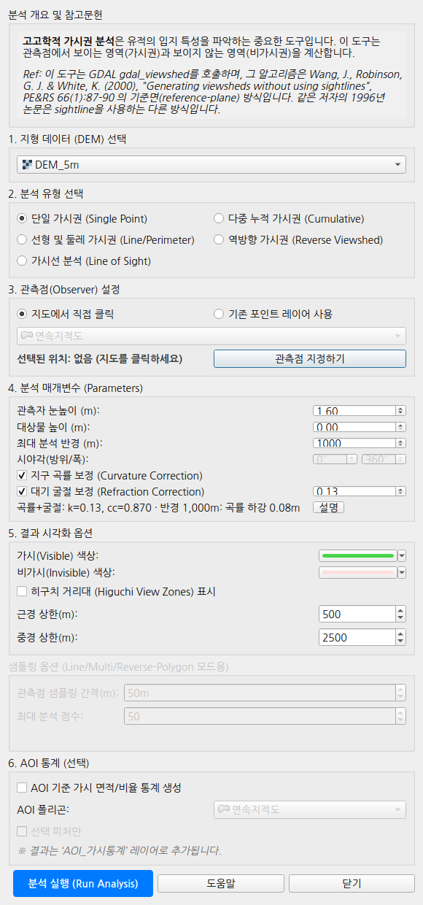
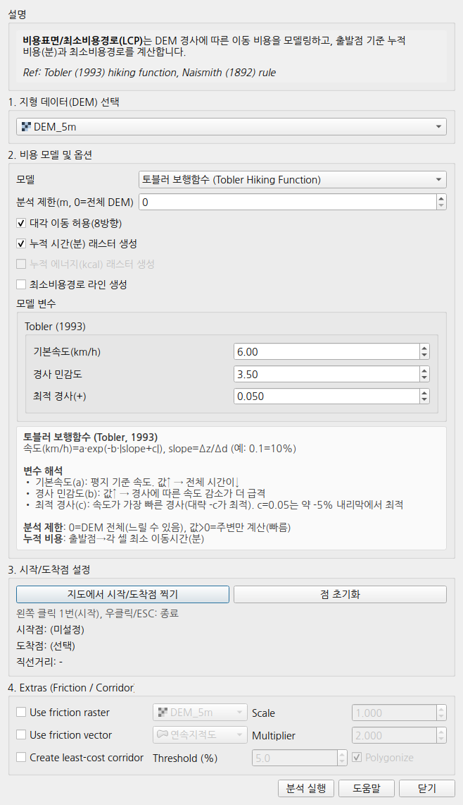
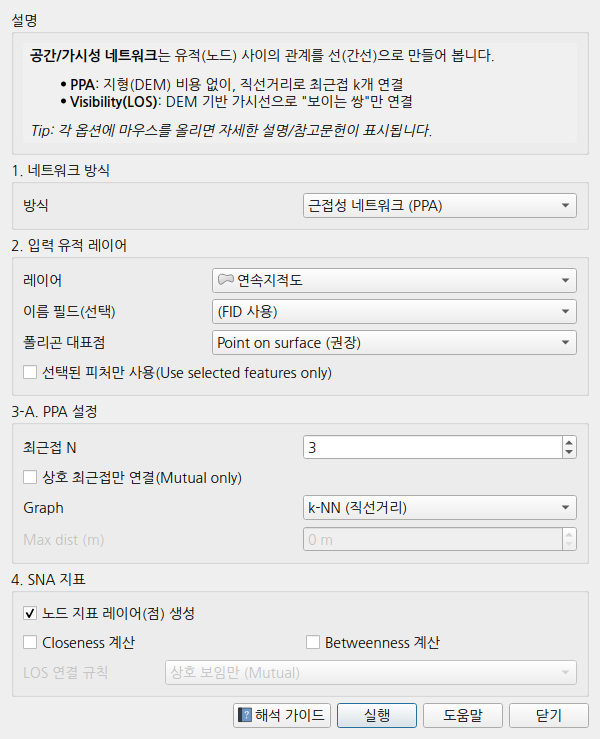

<p align="center">
  
</p>

<h1 align="center">ArchToolkit</h1>

<p align="center">
  <strong>한국 고고학·문화유산 조사를 위한 QGIS 종합 분석 플러그인</strong><br>
  DEM 생성부터 지형·가시권·이동비용·네트워크 분석, 입지적합도, 트렌치 제안, 도면화, AOI 보고서까지 한 흐름으로.
</p>

<p align="center">
  
  
  
  <a href="https://github.com/lzpxilfe/archtoolkit/actions/workflows/ci.yml"></a>
  
</p>

<p align="center">
  
  &nbsp;
  
</p>

> "지식은 전유물이 아닙니다"

ArchToolkit은 한국의 고고학·문화유산 조사와 연구에서 반복되는 GIS 작업 19가지를 하나의 QGIS 플러그인으로 묶은 도구 상자입니다. 수치지형도 DXF, 연속지적도, KIGAM 지질도·지구화학도 같은 국내 자료를 바로 다루고, QGIS 기본 구성(Processing·GDAL·NumPy)만으로 동작합니다. GRASS·SAGA·WhiteboxTools 같은 외부 의존성은 필요 없습니다.

## 이 플러그인이 지키는 것

실용적인 도구이면서 결과를 정직하게 말하는 도구가 되도록, 아래 여섯 가지를 코드와 테스트로 지킵니다.

| 원칙 | 어떻게 지키는가 |
| --- | --- |
| **근거 있는 계산** | 19개 도구 모두 도움말 끝에 **학술 근거와 권장 절차**를 둡니다. 어떤 연구를 구현했는지, 그 연구자가 의도한 사용법은 무엇인지, 이 도구가 주장하지 않는 것은 무엇인지 적습니다. 서지는 [REFERENCES.md](REFERENCES.md)와 일치해야 테스트가 통과합니다. |
| **출처를 섞지 않음** | (A) QGIS/GDAL 알고리즘 호출, (B) 플러그인이 직접 구현한 수식, (C) 맥락·후속 참고를 구분해 표기합니다. 등급 구간처럼 플러그인이 정한 것은 "플러그인 정의"라고 씁니다. |
| **재현 가능한 결과** | 결과 레이어에 도구·실행 ID·종류·단위·실행 파라미터(`params_json`)를 기록합니다. 보고서에 옮겨 적으면 그대로 재현할 수 있습니다. |
| **조용히 넘어가지 않음** | NoData, 버려진 피처, 스캔 한도, 색 매칭 실패, 검사 불가 쌍은 경고와 로그로 드러납니다. 실패한 실행을 "완료"라고 하지 않습니다. |
| **검증된 코드** | 단위 테스트 346건(실제 QGIS에서 실행)과 수정 전후 27개 시나리오를 실제 QGIS로 비교하는 [회귀 하네스](tests/regression/README.md)가 있습니다. 결과는 [회귀 비교 보고](docs/REGRESSION_REPORT.md)에 있습니다. |
| **쓰기 편한 도구** | 모든 대화상자가 마지막 입력값을 기억하고, 긴 연산은 실시간 로그로 따라갈 수 있으며, 결과는 `ArchToolkit - ...` 그룹에 정리됩니다. |

## 도구 한눈에 보기

| | 도구 | 하는 일 | 학술 근거 |
| :---: | --- | --- | --- |
|  | DEM 생성 | 등고선·표고점에서 TIN(선형·곡면)·IDW·Ordinary Kriging(Lite) DEM | Delaunay 1934; Clough & Tocher 1965; Shepard 1968; Matheron 1963 |
|  | 등고선 추출 | DEM에서 일정 간격 등고선 | GDAL contour |
|  | 지형 분석 | 경사·사면방향·TPI·지형 위치 분류·TRI·거칠기·곡률·사면 파생(TRASP) | Horn 1981; Weiss 2001; Riley et al. 1999; Wilson et al. 2007; Zevenbergen & Thorne 1987; Roberts & Cooper 1989 |
|  | 경사도/사면방향 도면화 | 인쇄용 경사 래스터와 사면방향 화살표 | Horn 1981 |
|  | 가시권 분석 | 단일·누적·역·선형 가시권, LOS 단면, 히구치 거리대, 곡률·굴절 보정 | Wang et al. 2000; Higuchi 1975/1983; Wheatley 1995 |
|  | 비용표면/최소비용경로 | 시간·에너지 비용표면, 최소비용경로, 회랑, 등시선 | Tobler 1993; Naismith 1892; Pandolf et al. 1977; Minetti et al. 2002 / Herzog 2013; Dijkstra 1959; Hart et al. 1968 |
|  | 최소비용 네트워크 | 유적 간 최소비용경로 기반 MST·k-NN·허브 네트워크와 중심성 | Kruskal 1956; Freeman 1979; Brandes 2001; Wasserman & Faust 1994 |
|  | 근접/가시성 네트워크 | PPA(k-NN·Delaunay·Gabriel·RNG)와 유적 간 상호가시성 네트워크 | Terrell 1977; Gabriel & Sokal 1969; Toussaint 1980; Van Dyke et al. 2016 |
|  | 거리 래스터 | 하천·유적·도로까지의 거리 예측변수 | GDAL proximity; Phillips et al. 2006 (후속) |
|  | 분석 결과 정렬/내보내기 | 예측변수 스택을 한 격자로 정렬하고 manifest와 함께 내보내기 | Phillips et al. 2006; Elith et al. 2011 (후속) |
|  | 변수 상관/VIF 리포트 | 상관행렬과 분산팽창지수 | O'Brien 2007 (임계값 경고) |
|  | AHP 입지적합도 | 쌍대비교 가중 적합도, 계층형 AHP, 일관성비율 | Saaty 1980; Alonso & Lamata 2006; Malczewski 2004 |
|  | 트렌치 후보 제안 | AOI 안에서 조건에 맞는 트렌치 배치 제안 | 플러그인 휴리스틱 (학술 방법 아님) |
|  | 지질도 도엽 ZIP | KIGAM 1:50,000 지질도 로드·스타일·범주형 래스터 | KIGAM 자료 |
|  | 지구화학도 래스터 수치화 | WMS 렌더링 색상을 범례로 값 역추정 | KIGAM WMS 범례 (추정값) |
|  | 지적도 중첩 면적표 | 조사구역과 필지의 중첩 면적표 | 지적 자료 |
|  | 지형 단면 | 단면선 작성, 다중 프로파일, 차트·CSV 내보내기 | 실무 기법 |
|  | 도면 시각화 | 수치지형도 DXF 분류 스타일, DEM 배경, 프리셋 내보내기 | 실무 기법 |
|  | AI 조사요약 | AOI 주변 레이어 통계 요약, 선택 시 Gemini 초안 | 실무 기법 (외부 전송 고지) |

도구별 자세한 기능과 해석 시 유의점은 [docs/TOOLS.md](docs/TOOLS.md)에, 모든 화면은 [docs/GALLERY.md](docs/GALLERY.md)에 있습니다.

<p align="center">
  
  &nbsp;
  
  &nbsp;
  
</p>

## 빠른 시작

1. 아래 설치 방법대로 플러그인을 설치하고 QGIS를 다시 시작합니다.
2. `Archaeology Toolkit` 메뉴 또는 툴바의 `ArchToolkit` 버튼에서 도구를 엽니다.
3. DEM이 없다면 `DEM 생성`으로 수치지형도 등고선에서 DEM을 만듭니다.
4. `지형 분석`, `가시권 분석`, `비용표면/최소비용경로`를 조합하고, 예측모델용이면 `거리 래스터`와 `분석 결과 정렬/내보내기`로 변수 스택을 만듭니다.
5. 각 도구의 **도움말** 끝에 있는 "학술 근거와 권장 절차"를 읽고, 보고서에는 결과 레이어 메타데이터의 파라미터를 옮겨 적습니다.

## 설치

**요구 사항**: QGIS 3.40 LTR 이상, Processing 프레임워크, GDAL 프로바이더, NumPy가 포함된 QGIS Python. `AI 조사요약`의 Gemini 모드에서만 Gemini API 키가 필요합니다.

**QGIS 4(Qt6)**: 소스는 PyQt6와 QGIS 4가 요구하는 표기로 작성돼 있고(`qgisMaximumVersion=4.99`), QGIS 3.34에서 결과가 같음과 PyQt6 6.11에서 모든 Qt 이름이 존재함을 확인했습니다. 다만 QGIS 4 빌드에서 실제로 실행해 보지는 못했으므로, QGIS 4에서 문제가 보이면 [이슈](https://github.com/lzpxilfe/archtoolkit/issues)로 알려 주세요. 자세한 범위는 `docs/PUBLISHING.md` 6절에 있습니다.

공식 플러그인 저장소 등록을 준비 중이므로 당분간 GitHub에서 설치합니다. 두 가지 방법이 있습니다.

1. **ZIP으로 설치**: [Releases](https://github.com/lzpxilfe/archtoolkit/releases)의 `ArchToolkit-<버전>.zip`을 받아 QGIS의 **플러그인 → 플러그인 관리 및 설치 → ZIP에서 설치**로 올립니다. (개발자는 `python scripts/build_plugin_zip.py --check`로 같은 ZIP을 만듭니다.)
2. **폴더로 설치**: 저장소를 `ArchToolkit` 폴더명으로 아래 위치에 복사하거나 `git clone`한 뒤 QGIS를 재시작하세요.

```text
Windows: %APPDATA%\QGIS\QGIS3\profiles\default\python\plugins\ArchToolkit
macOS:   ~/Library/Application Support/QGIS/QGIS3/profiles/default/python/plugins/ArchToolkit
Linux:   ~/.local/share/QGIS/QGIS3/profiles/default/python/plugins/ArchToolkit
```

업데이트는 같은 폴더에서 `git pull`(또는 폴더 교체) 후 QGIS 재시작입니다.

## 결과 레이어와 메타데이터

결과는 가능한 한 `ArchToolkit - ...` 그룹 아래에 도구별로 정리됩니다. 주요 결과 레이어에는 다음 custom property가 기록됩니다.

| 키 | 내용 |
| --- | --- |
| `archtoolkit/tool_id` | 만든 도구 |
| `archtoolkit/run_id` | 실행 ID (같은 실행의 레이어를 묶음) |
| `archtoolkit/kind`, `archtoolkit/units` | 결과 종류와 단위 |
| `archtoolkit/params_json` | 실행 파라미터 (반경·임계값·모델·보정 여부 등) |

`AI 조사요약`과 `분석 결과 정렬/내보내기`는 이 메타데이터를 읽어 결과를 묶고, 범주형·방향 변수를 올바르게 리샘플링합니다.

## 해석할 때 유의할 점

- 가시권·비용·네트워크 결과는 DEM 해상도·좌표계·고도 품질에 크게 좌우됩니다. 결과와 함께 DEM 출처를 적으세요.
- 최소비용경로는 옛길의 증거가 아니라 가설이고, 가시권은 "지형이 가리지 않음"이지 "실제로 보였음"이 아닙니다.
- 화면의 등급 구간(5등급 등)은 대부분 플러그인의 표시 관례입니다. 원저자의 분류로 보고하려면 각 도움말의 안내를 따르세요.
- 지구화학도 값은 색상에서 역추정한 추정값이며, AI 초안과 트렌치 제안은 검토용입니다.

전체 목록은 [docs/TOOLS.md](docs/TOOLS.md#해석-주의)에 있습니다.

## 검증 방법

```bash
# QGIS 없이 (순수 코어 + 정적 검사)
python -m unittest discover -s tests -p "test_*.py"
python tests/check_static.py

# QGIS Python으로 (QGIS 의존 테스트까지 전부)
QT_QPA_PLATFORM=offscreen /usr/bin/python3 -m unittest discover -s tests -p "test_*.py"

# 수정 전후 회귀 비교 (tests/regression/README.md)
QT_QPA_PLATFORM=offscreen /usr/bin/python3 tests/regression/run_scenarios.py . /tmp/new.json

# QGIS 4(PyQt6) 표기 검사: QGIS 없이 PyQt6만 설치해 소스가 쓰는 모든 Qt 이름의 존재를 확인
python -m pip install PyQt6 && python -m unittest tests.test_qt6_compat
```

CI는 push마다 순수 테스트·정적 검사·flake8 차단 규칙·릴리스 정합성·PyQt6 표기 검사를 돌리고, QGIS 컨테이너에서 QGIS 의존 테스트를 실행합니다.

## 문서

| 문서 | 내용 |
| --- | --- |
| [docs/TOOLS.md](docs/TOOLS.md) | 도구별 기능 상세와 해석 주의 |
| [docs/GALLERY.md](docs/GALLERY.md) | 모든 도구 화면 |
| [REFERENCES.md](REFERENCES.md) | 알고리즘·수식의 원 출처 (A/B/C 표기, 검증 기록) |
| [docs/AHP_GUIDE.md](docs/AHP_GUIDE.md) | AHP 입지적합도 사용 설명서 |
| [docs/REGRESSION_REPORT.md](docs/REGRESSION_REPORT.md) | 수정 전후 회귀 비교 결과 |
| [docs/AUDIT_BACKLOG.md](docs/AUDIT_BACKLOG.md) | 감사 결과와 반영 상태 |
| [CHANGELOG.md](CHANGELOG.md) | 버전별 변경 이력 |
| [DEVELOPMENT.md](DEVELOPMENT.md) | 개발 원칙, 테스트, 게이트 |
| [docs/PUBLISHING.md](docs/PUBLISHING.md) | 플러그인 저장소 업로드, ZIP 빌드, QGIS 4 호환 범위 |
| [CONTRIBUTING.md](CONTRIBUTING.md) | 기여 가이드 |

## 인용

연구나 실무에서 사용했다면 [CITATION.cff](CITATION.cff)의 메타데이터로 인용할 수 있습니다.

```bibtex
@software{ArchToolkit_Hwang_2026,
  author  = {Hwang, Jinseo},
  title   = {ArchToolkit: Archaeology Toolkit for QGIS},
  year    = {2026},
  version = {0.1.4},
  url     = {https://github.com/lzpxilfe/archtoolkit}
}
```

<a href="https://github.com/lzpxilfe/archtoolkit"></a>

## 라이선스

`GPL-3.0-or-later`
