# 화면 모음

헤드리스 QGIS 3.34에서 `scripts/render_screenshots.py`로 렌더링한 실제 대화상자입니다(합성 샘플 프로젝트 사용).

| 도구 | 화면 |
| --- | --- |
| DEM 생성 | 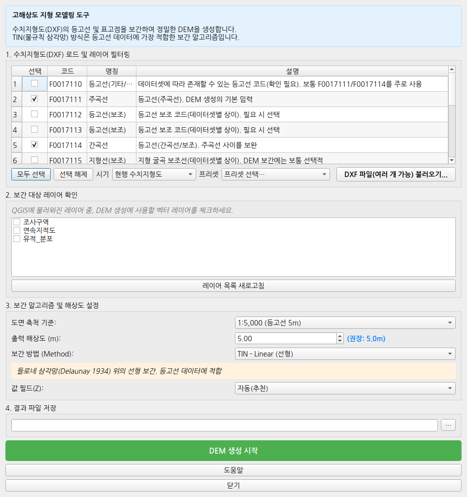 |
| 등고선 추출 | 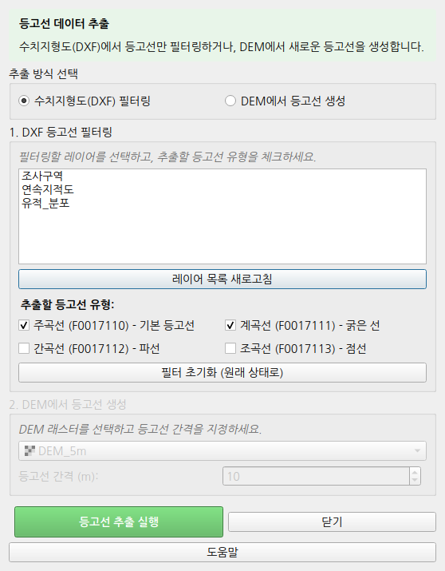 |
| 지형 분석 |  |
| 지형 분석 도움말 (학술 근거와 권장 절차) |  |
| 경사도/사면방향 도면화 | 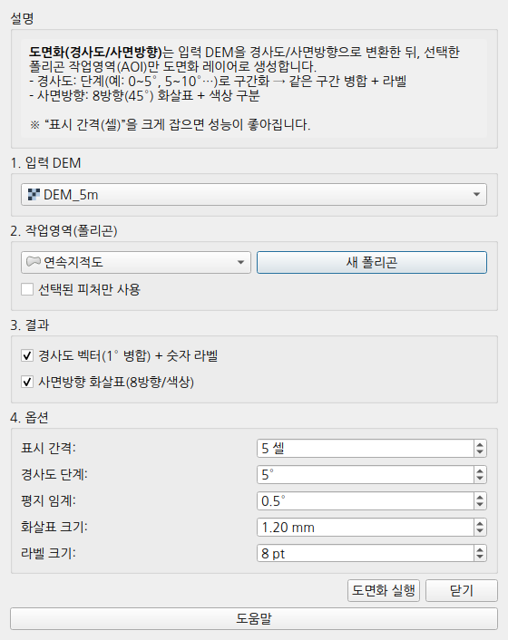 |
| 가시권 분석 |  |
| 비용표면/최소비용경로 |  |
| 최소비용 네트워크 | 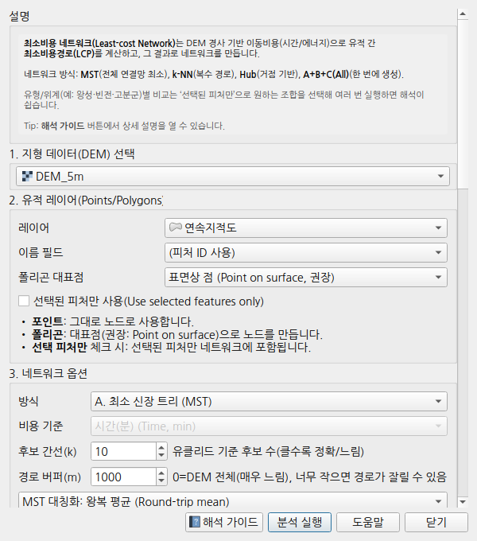 |
| 근접/가시성 네트워크 |  |
| 근접/가시성 네트워크 도움말 | 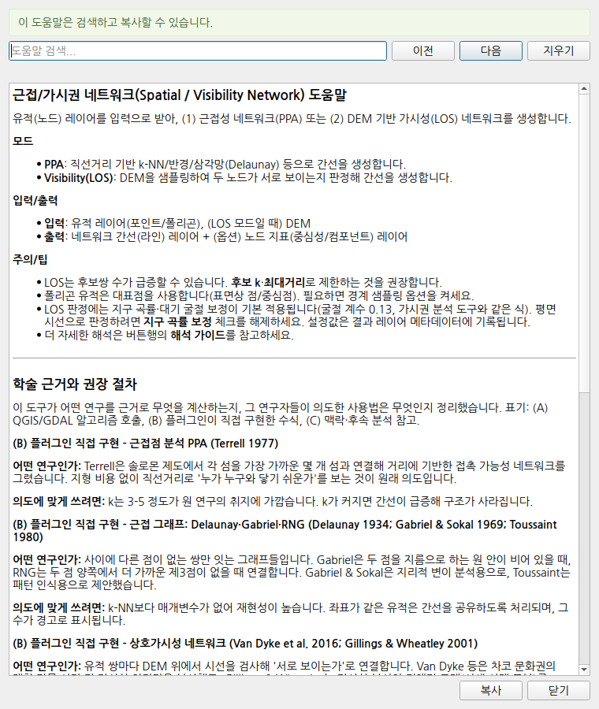 |
| 거리 래스터 | 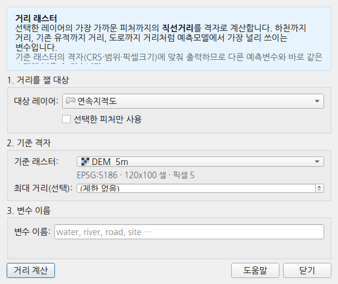 |
| 분석 결과 정렬/내보내기 | 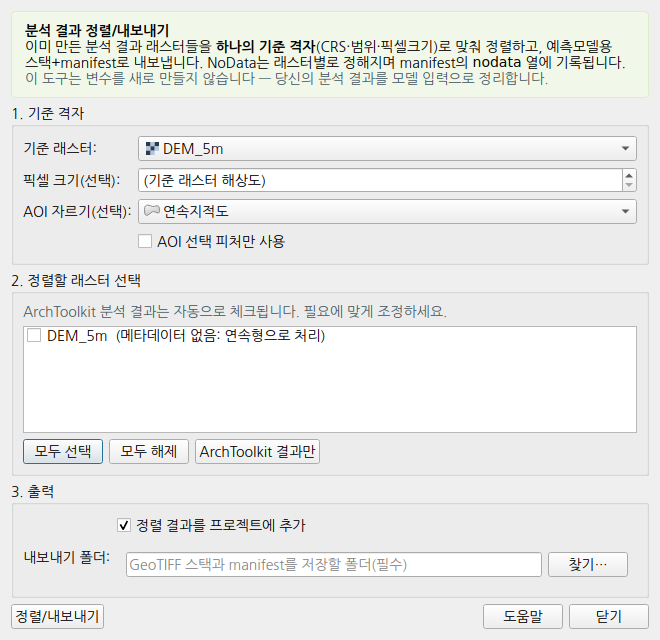 |
| 변수 상관/VIF 리포트 | 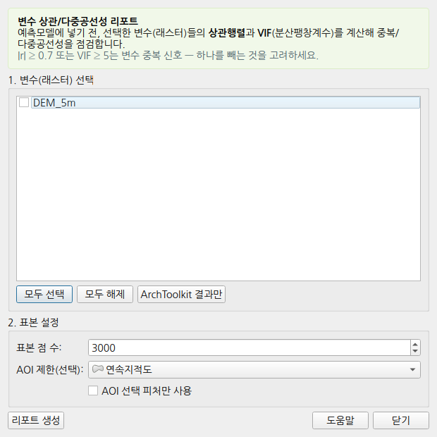 |
| AHP 입지적합도 | 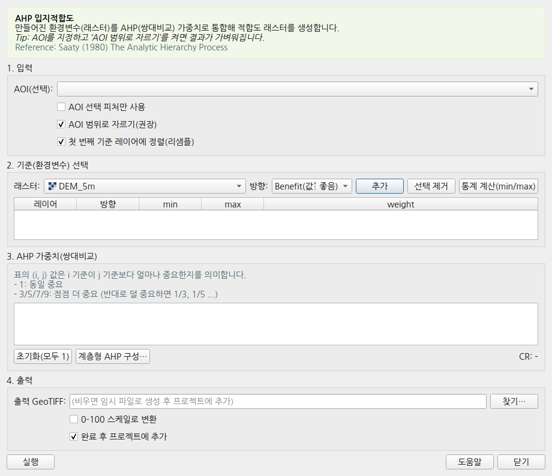 |
| 트렌치 후보 제안 | 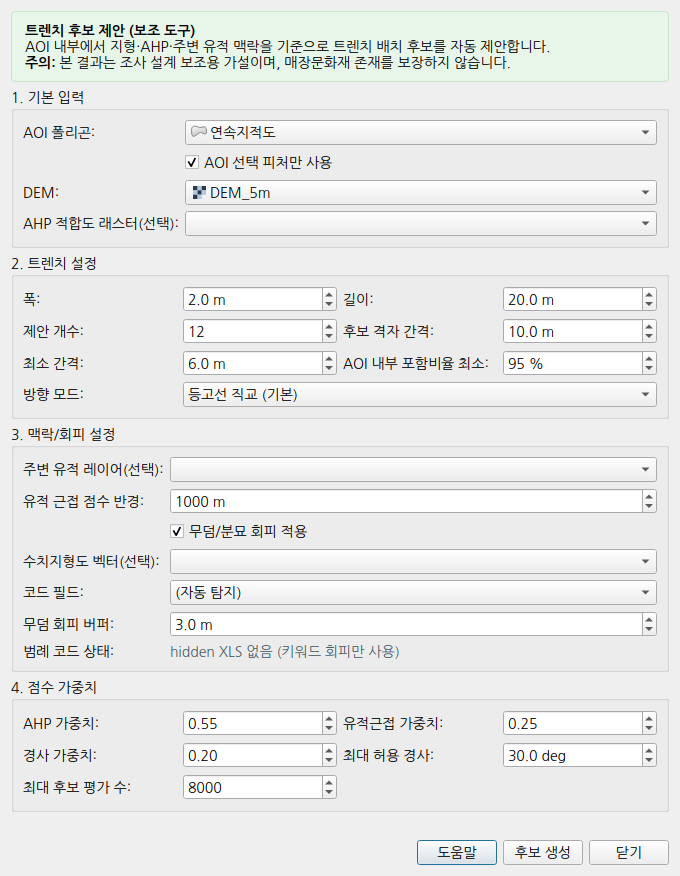 |
| 지질도 도엽 ZIP | 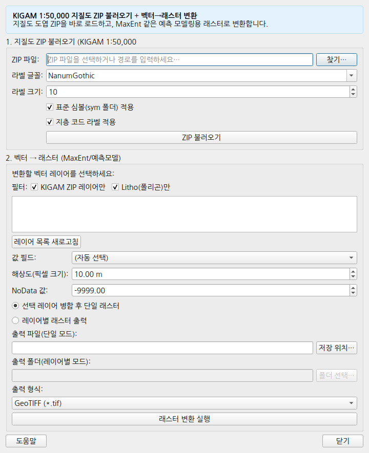 |
| 지구화학도 래스터 수치화 | 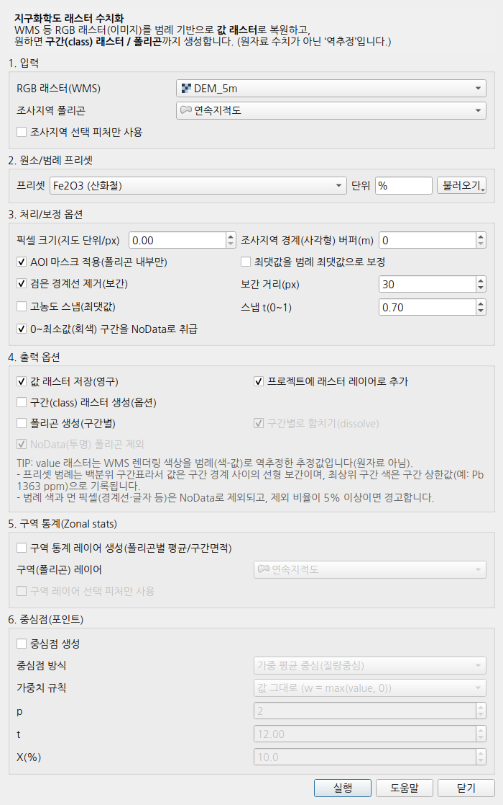 |
| 지적도 중첩 면적표 | 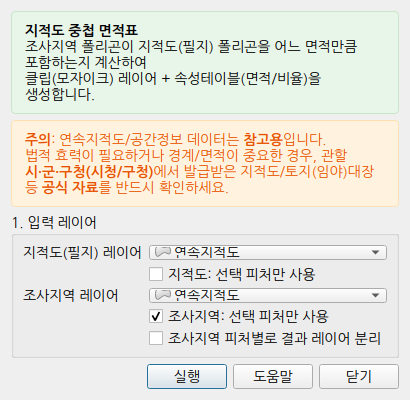 |
| 지형 단면 | 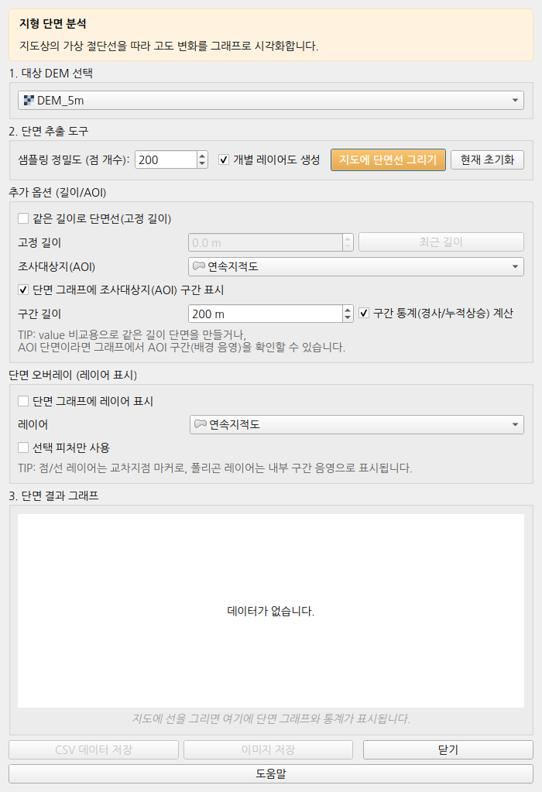 |
| 도면 시각화 | 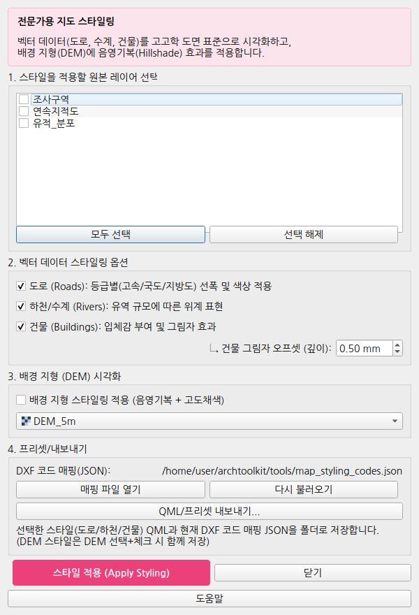 |
| AI 조사요약 | 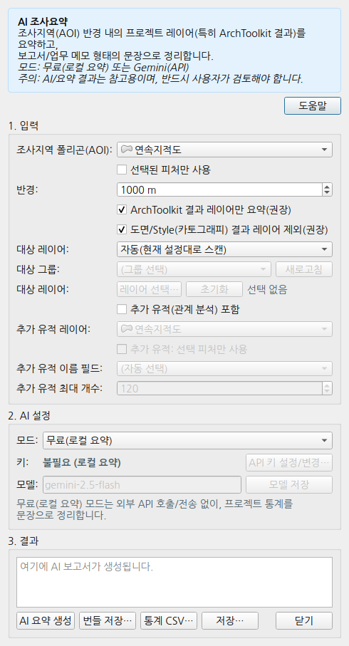 |

다시 만들려면 (QGIS Python 필요):

```bash
QT_QPA_PLATFORM=offscreen /usr/bin/python3 scripts/render_screenshots.py
```
