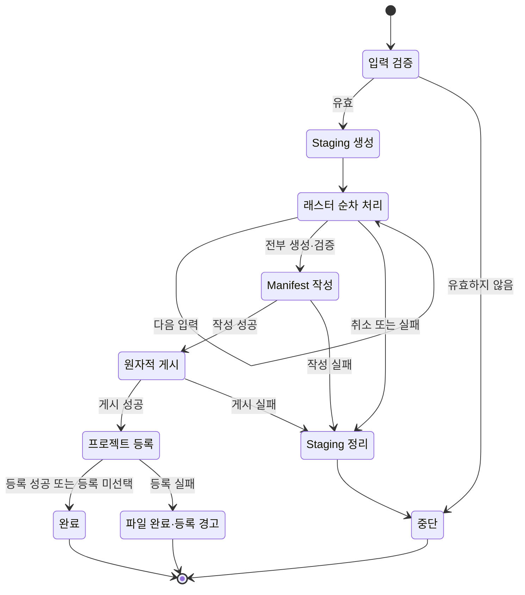

# ArchToolkit 릴리스·출력 안전성 보강 구현설계서

문서 상태: 구현 기준 초안

작성 기준일: 2026-07-13

대상 기준: `agent/release-safety-foundation` 작업 트리

관련 문서: `README.md`, `DEVELOPMENT.md`, `STABILITY.md`, `SMOKE_TEST.md`

## 1. 문서 목적

이 문서는 ArchToolkit의 기능 수를 늘리는 대신, 이미 있는 기능을 신뢰할 수 있게 만드는 이번 보강 작업의 의도와 실제 구현 경계를 기록한다. 핵심 대상은 다음 두 가지다.

1. 저장소 곳곳에 흩어진 버전·상태·인용 정보가 서로 어긋난 채 배포되는 문제를 CI에서 차단한다.
2. `분석 결과 정렬/내보내기`가 취소되거나 중간에 실패했을 때 일부 파일을 완성 결과처럼 노출하지 않도록 출력 단위를 원자적으로 게시한다.

여기에 사용자가 직접 체감하는 UI 품질 원칙도 함께 고정한다. 버튼과 도구 이름에 이모지를 장식처럼 붙이지 않고, 실제로 식별에 도움이 되는 아이콘이 필요하면 프로젝트에 포함되는 제한 팔레트 픽셀 아이콘을 직접 제작한다.

이 문서는 계획서이면서 현재 구현의 설명서다. 따라서 현재 코드가 보장하는 내용과 아직 검증하지 못한 내용을 분리해 적는다.

## 2. 목표와 비목표

### 2.1 목표

- `metadata.txt`를 릴리스 식별 정보의 기준점으로 삼고 README, BibTeX, `CITATION.cff`, Git 태그가 그 기준과 일치하는지 자동 검증한다.
- 검증기는 Python 표준 라이브러리만 사용해 의존성 설치 전에도 CI에서 실행할 수 있게 한다.
- 정렬 결과의 래스터, manifest, 기준 격자 정보를 하나의 실행별 디렉터리로 묶어 한 번에 게시한다.
- 취소와 실패를 성공으로 오인하지 않고, 게시 전의 부분 산출물은 정리한다.
- QGIS Processing 취소 신호가 실행 중인 GDAL 작업까지 전달되게 한다.
- 게시가 끝난 파일과 QGIS 프로젝트 레이어 등록을 별도의 성공 경계로 다룬다.
- 출력 정리 코드가 사용자의 임의 디렉터리를 삭제하지 못하도록 소유권 표식을 검사한다.
- 릴리스 식별 규칙과 출력 게시 규칙을 표준 라이브러리 단위 테스트로 고정한다.
- 런타임 UI 문자열에서 장식용 이모지를 걷어내고, 필요한 도구 아이콘은 저장소에 포함되는 픽셀 아트 자산으로 대체한다.

### 2.2 비목표

- 이번 작업은 ArchToolkit 전체 도구의 출력 체계를 한 번에 원자적 게시 방식으로 바꾸지 않는다.
- 정렬 알고리즘, 보간 수식, 범주형·연속형 판정 규칙을 새로 설계하지 않는다.
- 여러 래스터를 동시에 병렬 처리하지 않는다. 현재 구현은 선택 순서대로 한 개씩 처리한다.
- 전체 `CITATION.cff` YAML 스키마를 검증하는 범용 CFF 검증기를 만들지 않는다. 이번 검증기는 필요한 최상위 스칼라만 제한적으로 읽는다.
- 기존 저장소의 모든 스타일 경고를 이번 변경에서 해소하지 않는다. 치명적인 정적 오류는 차단하되, 기존 스타일 부채는 계속 정보성 결과로 남긴다.
- 개발 규칙과 학술 표기에서 의미를 갖는 허용·금지·방향 기호까지 일괄 제거하지 않는다. 무이모지 원칙의 적용 대상은 QGIS 런타임 UI와 공개 첫 화면인 README의 장식용 pictograph다.
- QGIS 자체, GDAL 공급자, 네트워크 파일시스템이 제공하지 않는 강제 취소나 영속성 보장을 새로 만들지 않는다.

## 3. 설계 원칙

### 3.1 QGIS 기본 구성만으로 동작

`DEVELOPMENT.md`의 원칙에 따라 런타임 구현은 QGIS Core/GUI, PyQt, GDAL Processing, Python 표준 라이브러리만 사용한다. 별도 설치가 필요한 패키지를 원자적 출력이나 릴리스 검증에 추가하지 않는다.

### 3.2 게시 전에는 임시, 게시 후에는 완성

파일이 하나 생성됐다는 사실과 사용자에게 제공할 결과 묶음이 완성됐다는 사실을 구분한다. 모든 필수 래스터와 sidecar가 생성·검증된 뒤 실행 디렉터리 이름을 원자적으로 바꾸는 순간을 게시 시점으로 정의한다.

### 3.3 취소는 정상적인 비성공 종료

사용자 취소는 예외적인 크래시가 아니지만 성공도 아니다. 취소 시에는 별도 메시지를 보여주고, 완료 메시지·manifest 게시·프로젝트 레이어 추가를 수행하지 않는다.

### 3.4 삭제보다 보존을 우선

정리 함수는 이름 규칙과 ArchToolkit 소유권 marker가 모두 확인된 staging 디렉터리만 삭제한다. 게시가 이미 끝난 결과나 사용자가 만든 일반 디렉터리는 정리 대상으로 보지 않는다.

### 3.5 자동 검증 가능한 규칙만 릴리스 규칙으로 선언

버전, 상태, URL, 라이선스, 릴리스 날짜처럼 기계적으로 판별할 수 있는 값은 CI 불변식으로 만든다. “충분히 안정적이다” 같은 판단은 스모크 테스트와 실사용 확인의 영역으로 남긴다.

## 4. 변경 구조 개요

이번 보강은 세 층으로 나뉜다.

| 층 | 책임 | 주요 구현 |
| --- | --- | --- |
| 릴리스 정합성 | 배포 전에 저장소 식별 정보의 불일치를 차단 | `scripts/check_release_identity.py`, CI, 단위 테스트 |
| 출력 트랜잭션 | 부분 산출물을 숨기고 완성된 실행 묶음만 게시 | `tools/atomic_output.py`, `tools/align_export_dialog.py` |
| UI 표현 | 장식용 이모지를 제거하고 필요한 도구에 직접 제작한 아이콘 적용 | `.ui`·대화상자 문자열, `align_export_icon.xpm`, `arch_toolkit.py` |

QGIS 런타임 코드는 정렬 실행을 조정하고, 파일시스템 세부 규칙은 QGIS를 import하지 않는 `atomic_output.py`에 둔다. 이 분리 덕분에 위험한 삭제·게시 규칙은 일반 Python 환경에서 빠르게 회귀 테스트할 수 있다.

## 5. 릴리스 정합성 설계

### 5.1 기준 정보와 파생 정보

`metadata.txt`의 `[general]`을 기준 정보로 취급한다.

| 기준 값 | 일치해야 하는 대상 |
| --- | --- |
| `version` | README Version badge의 alt 값과 shield URL, README BibTeX `version`, CFF `version`, 릴리스 태그 `v<version>`, changelog 선두 버전 |
| `experimental`, `deprecated` | README Status badge의 alt 값과 shield URL |
| `repository` | README BibTeX `url`, CFF `repository-code` |
| `homepage` | CFF `url` |
| `license` | README License badge의 alt 값과 shield URL, CFF `license` |
| `tracker` | 특정 저장소 경로로 강제하지 않고 유효한 절대 HTTP(S) URL인지 확인 |

현재 작업 기준 버전은 `0.2.0`이고, `experimental=false`, `deprecated=false`이므로 표시 상태는 `stable`이다. 이 상태 표시는 메타데이터 플래그의 기계적 표현이며, QGIS 런타임 통합 검증을 모두 마쳤다는 의미로 사용하지 않는다.

### 5.2 상태 결정 규칙

상태는 임의 문자열이 아니라 다음 우선순위로 계산한다.

1. `deprecated=true`이면 `deprecated`
2. 그렇지 않고 `experimental=true`이면 `experimental`
3. 두 값이 모두 `false`이면 `stable`

두 플래그는 대소문자를 정규화한 뒤에도 값 자체가 정확히 `true` 또는 `false`여야 한다. `yes`, `0`, 빈 값 같은 느슨한 표현은 실패한다.

### 5.3 버전·badge·BibTeX 규칙

- 버전은 `X.Y.Z` 형태의 세 숫자 구간만 허용한다.
- README에는 Version, Status, License badge가 각각 정확히 하나 있어야 한다.
- badge의 사람이 읽는 `alt` 값과 shields.io URL에 들어간 값은 각각 독립적으로 검사한다.
- README의 fenced `bibtex` 블록 중 `ArchToolkit` 소프트웨어 항목이 정확히 하나 있어야 한다.
- 해당 BibTeX의 버전과 저장소 URL은 메타데이터와 같아야 한다.
- `metadata.txt` changelog는 현재 버전으로 시작해야 하며, `0.2.0`과 `0.2.01` 같은 접두사 오인도 허용하지 않는다.

### 5.4 CFF 규칙

- `version`, `repository-code`, `url`, `license`를 검사한다.
- 최상위 키가 중복되면 뒤의 값으로 조용히 덮지 않고 실패한다.
- 인용부호 바깥의 YAML inline comment는 제거한 뒤 값을 비교한다.
- `date-released`가 존재하면 `YYYY-MM-DD` 형식의 실제 달력 날짜여야 한다. 날짜에 timezone이 없으므로 UTC CI와 UTC+14까지의 현지 날짜 차이를 고려해 실행일의 다음 날까지 허용하고, 그보다 먼 미래 날짜는 거부한다.
- 일반 브랜치와 일반 커밋에서는 `date-released`가 없어도 된다. 실제 릴리스 태그 검증에서는 반드시 있어야 한다.

이 파서는 전체 YAML 문법을 구현하지 않는다. CFF 구조·작성자·키워드까지 정식 스키마 검증하는 작업은 후속 과제다.

### 5.5 URL과 QGIS category 규칙

- `repository`, `tracker`, `homepage`는 공백이 없는 절대 `http` 또는 `https` URL이어야 한다.
- tracker와 homepage가 GitHub 저장소의 고정 하위 경로일 필요는 없다. 별도 문서 사이트나 이슈 시스템을 허용한다.
- `category`가 있으면 QGIS가 허용하는 `Database`, `Mesh`, `Raster`, `Vector`, `Web` 중 하나여야 한다.
- 기존의 `category=Analysis`는 허용 목록 밖이므로 현재 메타데이터에서 제거했다.

### 5.6 릴리스 태그와 날짜

CI에서 `vX.Y.Z` 패턴인 태그만 릴리스 태그로 취급한다. 스냅샷 태그와 `pallet-town`, `viridian-city` 계열 태그는 일반 정합성 검사만 실행한다.

릴리스 태그에서는 다음 조건이 추가된다.

- 태그 이름은 정확히 `v<metadata version>`이어야 한다.
- `CITATION.cff`의 `date-released`가 있어야 한다.
- annotated tag라면 tagger 날짜, lightweight tag라면 대상 commit 날짜를 기준 날짜로 사용한다.
- CFF 날짜는 기준 날짜와 정확히 같아야 한다.

이 규칙 때문에 평상시 CFF에 임의의 예상 출시일을 넣어둘 필요가 없다. 릴리스 커밋에서 실제 태그 날짜를 넣고 검증한 뒤 태그를 생성한다.

## 6. 정렬/내보내기 원자성 설계

### 6.1 출력 단위

한 번의 실행은 다음 파일을 포함하는 하나의 bundle이다.

```text
aligned_stack_<run_id>/
├── <variable-1>.tif
├── <variable-2>.tif
├── ...
├── aligned_stack_manifest.csv
└── aligned_stack_grid.json
```

`manifest.csv`는 변수명, 파일명, 원본 레이어명, kind, units, resampling을 기록한다. 파일 경로는 bundle 내부의 basename으로 기록한다. `grid.json`은 기준 CRS, 요청 extent, GDAL이 실제 생성할 canonical extent, width, height, X/Y 픽셀 크기, 연속형 NoData, run id를 기록한다.

### 6.2 staging 디렉터리

staging 디렉터리는 사용자가 지정한 내보내기 디렉터리 바로 아래에 만든다. 이름은 숨김 접두사와 `.staging` 접미사를 사용하며 내부에는 `.archtoolkit-staging.json` marker가 생성된다.

같은 부모 아래에 staging을 두는 이유는 게시 시 디렉터리 rename이 같은 파일시스템 안에서 일어나게 하기 위해서다. `publish_staging_dir()`은 최종 경로가 이미 존재하면 덮어쓰지 않고 실패하며, 정상 게시에서는 `os.replace()`로 디렉터리 전체를 한 번에 이동한다.

marker에는 `owner`, `purpose`, 정규화된 `run_id`가 들어간다. 정리 함수는 다음 조건을 모두 만족할 때만 디렉터리를 지운다.

- 실제 디렉터리다.
- 이름이 `.staging`으로 끝난다.
- marker 파일이 존재하고 JSON으로 읽힌다.
- marker의 owner가 `ArchToolkit`이다.

POSIX의 `mkdtemp()`는 기본적으로 owner 전용 `0700` 디렉터리를 만든다. ArchToolkit은 실행 중 staging root를 계속 owner 전용으로 유지해 부분 결과와 검증 전 파일을 그룹 사용자에게 노출하지 않는다. 게시 직전에는 아직 비공개인 staging 안에서 일반 파일과 중첩 디렉터리의 mode를 부모 공유 폴더 정책에 맞춰 best-effort로 준비한다. 일반 파일은 owner read/write와 부모의 group/other read/write 비트를, 중첩 디렉터리는 owner rwx와 부모의 group/other rwx 및 setgid 의도를 따른다. 심볼릭 링크는 따라가지 않고 권한 변경 대상에서 제외한다.

`publish_staging_dir()`은 staging과 게시 부모가 같은 resolved parent일 때만 실행한다. 이는 동일 파일시스템 rename 원자성과 setgid 그룹 상속 기대를 함께 지키기 위한 현재 계약이다. rename 뒤 marker를 제거하고, 마지막 단계에서 최종 bundle root를 부모 공유 정책에 맞춰 공개한다. chmod/fchmod 실패는 데이터 손실보다 낮은 위험으로 보아 게시 자체를 되돌리지 않지만, 가능한 경우 owner가 계속 접근할 수 있는 보수적인 mode가 남는다.

### 6.3 상태 전이



파일 결과의 commit point는 staging 디렉터리를 최종 디렉터리로 rename하는 순간이다. 그 전에는 어떤 래스터가 생성됐더라도 완성 결과가 아니다. 그 후에는 QGIS 프로젝트 등록이 실패해도 완성 파일을 삭제하지 않는다.

### 6.4 래스터 처리와 검증

각 입력은 선택 순서대로 처리된다.

1. 사용자 취소 여부를 확인한다.
2. 레이어와 소스 경로가 여전히 존재하는지 확인한다.
3. categorical이면 nearest, 그 외에는 bilinear 설정으로 `gdal:warpreproject` 작업을 만든다.
4. 결과를 staging 내부 `<key>.tif`에 쓴다.
5. 취소 여부와 출력 파일 존재 여부를 다시 확인한다.
6. `QgsRasterLayer`로 결과를 열어 최소 한 band, 양의 width·height, 읽을 수 있는 provider를 확인한다.
7. 출력 CRS가 기준 CRS와 같은지 QGIS CRS 객체 기준으로 검사한다.
8. 출력 width, height, extent, X/Y 픽셀 크기가 GDAL canonical target grid와 맞는지 절대오차 기준으로 검사한다.
9. 출력 band 수가 입력 band 수와 같은지 확인한다.
10. 연속형 출력은 모든 band의 NoData가 `-9999`인지 확인하고, 범주형 출력은 입력 source NoData가 band별로 상속됐거나 입력에 없으면 출력에도 없는지 확인한다.
11. 모든 band에서 대표 block을 읽어 provider가 실제 픽셀을 반환하는지 확인한다.

GDAL `-te`와 `-tr` 조합은 요청 extent가 해상도의 정수배가 아닐 때 반대편 경계를 조정한다. ArchToolkit은 `xmin`과 `ymax`를 고정하고 `floor(span / resolution + 0.5)`로 셀 수를 계산한 canonical target grid를 검증 기준으로 삼는다. 따라서 정상적인 GDAL rounding은 false reject하지 않으면서, 한 픽셀 origin 이동, 크기, 해상도, NoData, CRS 불일치는 게시 전에 차단한다. 회전·기울어진 기준 래스터와 기본 해상도 사용 시 비정사각 픽셀 기준 래스터는 현재 지원하지 않는다.

### 6.5 취소 모델

진행 대화상자의 취소 신호는 현재 warp의 `QgsProcessingFeedback.cancel()`과 `QgsProcessingAlgRunnerTask.cancel()` 양쪽에 전달된다. 호출 전, 작업 종료 후, 각 항목 사이에서도 취소 상태를 확인한다.

취소가 확인되면 `_Cancelled` 경로로 이동해 다음을 수행한다.

- marker가 확인된 staging 트리를 삭제한다.
- manifest와 최종 bundle을 게시하지 않는다.
- QGIS 프로젝트에 레이어를 추가하지 않는다.
- 완료 메시지 대신 “취소됨: 부분 결과를 게시하거나 프로젝트에 추가하지 않았습니다”를 표시한다.
- 로그에는 warning 수준으로 취소 사실과 run id를 남긴다.

취소는 QGIS와 Processing provider의 협력적 취소 메커니즘에 의존한다. QGIS 3.44.8에서는 실제 취소 버튼 클릭 후 약 0.10초 안에 GDAL subprocess가 중단되고 `_Cancelled`로 종료되는 것을 확인했다. 다만 이 측정은 모든 지원 OS·QGIS 3.40+ 조합의 동일한 응답 시간을 보장하지 않으므로, 릴리스 대상 환경별 스모크 테스트는 계속 필요하다.

### 6.6 실패 모델

| 실패 시점 | 현재 동작 | 사용자에게 보이는 결과 |
| --- | --- | --- |
| 입력·내보내기 경로 검증 전 | 실행하지 않음 | 오류 메시지, 파일 없음 |
| staging 생성 | 실행 중단 | 오류 메시지, 생성 실패한 임시 경로는 가능한 범위에서 정리 |
| 입력 레이어/소스 확인 | staging 정리 | 최종 bundle 없음 |
| GDAL 작업 또는 공급자 오류 | staging 정리 | 최종 bundle 없음 |
| 출력 파일 기본 검증 | staging 정리 | 최종 bundle 없음 |
| manifest/grid 작성 | staging 정리 | 최종 bundle 없음 |
| 최종 이름 충돌 또는 rename 실패 | staging 정리 시도 | 기존 최종 bundle은 덮어쓰지 않음 |
| 게시 후 marker 삭제 | 게시 결과 보존 | 숨은 marker가 남을 수 있으나 완성 파일은 유지 |
| 게시 후 QGIS 레이어 등록 | 추가된 레이어와 그룹을 되돌림 | 파일은 유지하고 프로젝트 등록 실패 경고 |
| QGIS 비정상 종료·전원 중단 | 예외 정리 경로가 실행되지 않을 수 있음 | marker가 있는 staging이 남을 수 있음 |

프로세스가 비정상 종료된 경우를 위한 자동 복구나 오래된 staging 자동 삭제는 현재 없다. 남은 디렉터리는 marker와 접미사를 확인한 뒤 운영자가 정리해야 한다.

QGIS GDAL provider는 stderr의 warning과 실제 오류를 모두 `reportError()` 채널로 전달할 수 있고, GDAL nonzero exit도 task 성공처럼 보일 수 있다. `_GdalOutcomeFeedback`은 diagnostic의 문구를 영어 warning regex로 분류하지 않고, QGIS GDAL provider의 현재 번역된 `Process completed successfully` marker가 마지막 diagnostic 뒤에 들어왔는지를 기록한다. 취소, task 미완료, fatal diagnostic, marker 누락, marker 뒤 diagnostic은 모두 실패로 처리한다. exit-0 marker가 확인된 nonfatal diagnostic만 warning 로그로 남기고, 그 뒤에도 강화된 래스터 검증을 통과해야 게시할 수 있다.

### 6.7 프로젝트 레이어 등록의 트랜잭션 경계

게시된 모든 출력 래스터를 먼저 열어 유효성을 확인하고 메타데이터를 설정한 뒤 그룹을 생성한다. 그룹에 추가하는 중 오류가 나면 이미 추가된 레이어를 프로젝트에서 제거하고, 이번 실행 그룹과 이번 호출에서 새로 만든 빈 부모 그룹을 제거한다.

파일 게시와 프로젝트 등록은 의도적으로 하나의 트랜잭션으로 묶지 않는다. 파일 bundle은 완성된 연구 산출물이고 프로젝트 등록은 편의 기능이기 때문이다. 따라서 등록 실패가 완성 파일 삭제로 이어지지 않는다.

## 7. QGIS Task Manager 선택 근거

이전의 직접 `processing.run()` 호출은 모달 진행창을 띄운 상태에서 GUI thread의 긴 실행 경계를 만들고, 진행창 취소를 현재 GDAL 처리에 명시적으로 연결하지 못했다.

현재 구현은 다음 조합을 사용한다.

- `QgsApplication.processingRegistry()`에서 `gdal:warpreproject` 알고리즘을 가져온다.
- 프로젝트가 연결된 `QgsProcessingContext`를 만든다.
- 오류 메시지를 수집하는 `QgsProcessingFeedback` 하위 클래스를 사용한다.
- `QgsProcessingAlgRunnerTask`를 QGIS task manager에 등록한다.
- 대화상자 측에서는 짧은 `QEventLoop`로 해당 작업의 종료 신호를 기다린다.
- 사용자가 취소하면 feedback과 task를 모두 취소한다.

이 선택은 QGIS가 제공하는 Processing task 수명주기와 취소 경로를 그대로 사용하고, QGIS 객체를 임의의 Python thread로 옮기지 않기 위한 것이다. 입력을 병렬로 실행하지 않으므로 메모리·디스크 부하를 예측하기 쉽고 manifest 순서도 안정적이다.

다만 이것은 대화상자를 완전한 비동기 job UI로 바꾸는 설계가 아니다. 대화상자는 현재 항목의 작업 종료를 기다리되 이벤트 처리를 유지하는 구조다. 실제 QGIS 3.44.8에서 활성 GDAL 취소와 provider 오류 차단은 검증했지만, 창 닫기, 플러그인 unload, QGIS 종료와 다른 provider 버전의 응답은 별도 검증해야 한다.

## 8. 사용자 경로와 호환성 변경

이번 보강은 사용자에게 보이는 출력 경로를 의도적으로 바꾼다.

| 항목 | 이전 | 현재 |
| --- | --- | --- |
| 내보내기 폴더 | 비워두면 시스템 임시 폴더 사용 가능 | 사용자가 반드시 지정 |
| 래스터 위치 | 지정 폴더 바로 아래 또는 시스템 임시 폴더 | 지정 폴더 아래 `aligned_stack_<run_id>/` |
| manifest 위치 | 지정 폴더 바로 아래 | 실행별 bundle 내부 |
| 부분 출력 | 일부 성공 파일이 남고 완료 흐름이 이어질 수 있음 | 게시 전 취소·실패 시 최종 bundle 없음 |
| 기존 최종 경로 충돌 | 개별 파일 수준의 덮어쓰기 가능성 | 기존 bundle 디렉터리를 덮어쓰지 않음 |

따라서 기존 자동화가 `<export_dir>/<variable>.tif`를 직접 참조했다면 새 bundle 디렉터리와 manifest 기준으로 경로를 갱신해야 한다. QGIS 프로젝트에 추가되는 레이어는 staging 경로가 아니라 게시가 끝난 최종 경로를 참조한다.

## 9. 무이모지 UI와 8비트 아이콘 원칙

### 9.1 문자열 원칙

- 버튼, 체크박스, table header, 상태 메시지에 장식용 이모지를 넣지 않는다.
- 중요한 상태는 `QMessageBox` icon, 색상, 명확한 제목과 문장으로 표현하고 유니코드 경고 그림에 의존하지 않는다.
- 선택 상태는 Qt control 자체로 표현하며 `✓`, 별표, 장식 기호를 상태 대용으로 쓰지 않는다.
- 추천 항목은 `(추천)`처럼 번역·검색·접근성이 유지되는 텍스트로 쓴다.
- 지도 클릭, 저장, 새로고침 같은 동작은 동사 중심의 짧은 라벨로 쓴다.

현재 작업 트리에서는 DEM 생성, 등고선, 지도 스타일링, 지형 분석, 지형 단면, 가시권 관련 런타임 문자열과 README의 장식용 이모지를 제거한다. 개발 규칙 문서의 허용·금지 표시는 의미형 기술 표기로 보고 별도 범위로 둔다.

### 9.2 아이콘 적용 기준

아이콘은 버튼 수를 꾸미기 위해 일괄 부착하지 않는다. 툴바에서 공간이 좁거나, 여러 도구 중 동작을 빠르게 구분하는 데 실제 도움이 되는 경우에만 추가한다. 텍스트 라벨과 tooltip은 유지해 아이콘만 보고 뜻을 추측하게 만들지 않는다.

새 아이콘의 기본 규칙은 다음과 같다.

- 저장소 안에 원본을 포함해 외부 CDN, OS emoji font, 플랫폼별 glyph에 의존하지 않는다.
- 1픽셀 격자를 살린 제한 팔레트의 8비트 게임풍 픽셀 아트로 직접 제작한다.
- 작은 크기에서 실루엣이 먼저 읽히게 하고, 장식보다 도구의 입력·처리·출력 개념을 표현한다.
- 투명 배경과 충분한 명도 대비를 둔다.
- Qt가 직접 읽을 수 있고 diff로 검토 가능한 XPM을 우선 고려한다.
- 실제 QGIS의 밝은·어두운 테마, 100%·고배율 디스플레이에서 식별성을 확인한다.

이번 구현의 `align_export_icon.xpm`은 32×32, 투명색을 포함한 8색 XPM이다. 겹친 격자와 바깥쪽 화살표로 “여러 래스터를 같은 격자로 정렬해 내보낸다”는 의미를 표현한다. `arch_toolkit.py`의 Align & Export action과 대화상자 창 아이콘 후보에서 이 자산을 사용한다.

“8비트”는 여기서 파일의 채널당 bit depth를 뜻하기보다 제한 팔레트와 픽셀 단위 형태를 갖는 시각 언어를 뜻한다. 향후 아이콘을 추가할 때도 같은 팔레트·격자·외곽선 규칙을 재사용해야 UI가 다시 혼잡해지지 않는다.

## 10. 파일별 변경 내역

| 파일 | 역할과 변경 |
| --- | --- |
| `.github/workflows/ci.yml` | 표준 라이브러리 단위 테스트와 릴리스 정합성 검사를 의존성 설치 전에 실행한다. `vX.Y.Z` 태그에서는 태그 날짜까지 검증한다. |
| `metadata.txt` | changelog에 원자적 bundle, 취소 정직성, 릴리스 정합성 검사를 기록하고 유효하지 않은 `Analysis` category를 제거한다. |
| `README.md` | 0.2.0/stable badge, 올바른 BibTeX URL·버전, 원자적 Align & Export 동작 설명으로 맞추고 장식용 이모지를 제거한다. |
| `CITATION.cff` | 버전과 SPDX license를 명시하고 실제 릴리스와 무관한 미리 기입된 날짜를 제거한다. |
| `scripts/__init__.py` | 검사 스크립트를 단위 테스트에서 module로 import할 수 있게 한다. |
| `scripts/check_release_identity.py` | 메타데이터·README·BibTeX·CFF·태그의 정합성을 표준 라이브러리만으로 검사한다. |
| `tools/atomic_output.py` | marker 기반 staging 생성·안전 정리·동일 부모 디렉터리 게시, POSIX 공유 폴더 권한 준비를 제공한다. QGIS 의존성이 없다. |
| `tools/gdal_outcome.py` | QGIS GDAL provider diagnostic과 localized success marker의 순서를 표준 라이브러리만으로 판정한다. |
| `tools/raster_grid_contract.py` | GDAL target grid canonicalization과 width/height/extent/resolution 비교를 표준 라이브러리만으로 수행한다. |
| `tools/align_export_dialog.py` | 필수 출력 폴더, task manager 기반 warp, 취소·실패 분기, GDAL outcome 판정, 정밀 출력 검증, manifest 작성, 원자적 게시, 프로젝트 등록 rollback을 구현한다. |
| `tests/test_atomic_output.py` | unmarked 삭제 거부, staging 정리, bundle 게시, marker 제거 실패, 기존 결과 보호, unmarked 게시 거부, symlink 거부, private staging, 공유 권한 상속을 검증한다. |
| `tests/test_gdal_outcome.py` | warning 문구 분류 없이 success marker 순서만으로 성공·실패를 판정하는 상태 기계를 검증한다. |
| `tests/test_raster_grid_contract.py` | GDAL canonical grid 반올림, subpixel 최소 1셀, origin·dimension·resolution mismatch, tolerance 경계를 검증한다. |
| `tests/test_release_identity.py` | badge, 상태 플래그, BibTeX, CFF, 날짜, URL, category, duplicate, changelog 경계를 검증한다. |
| `tests/test_align_export_qgis.py` | 실제 QGIS/GDAL 환경에서 활성 작업 취소, valid-looking 부분 TIFF의 provider 오류 차단, 비정수배 extent의 canonical grid 검증, 한 픽셀 origin mismatch 차단을 검증하며, PyQGIS가 없으면 skip한다. |
| `tests/test_ui_assets.py` | 런타임 UI·README 무이모지 정책, XPM 크기·팔레트, 전용 action 연결을 검증한다. |
| `align_export_icon.xpm` | Align & Export 전용 32×32 제한 팔레트 픽셀 아이콘을 추가한다. |
| `arch_toolkit.py` | Align & Export action이 전용 XPM 아이콘을 사용하게 한다. |
| `tools/contour_extractor_dialog_base.ui` | 새로고침·초기화 버튼의 장식용 이모지를 제거한다. |
| `tools/dem_generator_dialog.py`, `tools/dem_generator_dialog_base.ui` | 설명, 선택 header, 불러오기·새로고침·실행 UI의 장식용 이모지를 제거한다. |
| `tools/map_styling_dialog_base.ui` | 대상 선택과 내보내기·적용 UI의 장식용 이모지를 제거한다. |
| `tools/terrain_analysis_dialog.py`, `tools/terrain_analysis_dialog_base.ui` | 고급 설정, 추천, 자동 SD 표현을 일반 텍스트로 바꾼다. |
| `tools/terrain_profile_dialog_base.ui` | 지도 입력과 CSV·이미지 저장 버튼의 장식용 이모지를 제거한다. |
| `tools/viewshed_dialog.py`, `tools/viewshed_dialog_base.ui` | 동적·정적 지도 선택 라벨, 도움말, 상태·경고 문구의 장식용 이모지를 제거한다. |
| `docs/HARDENING_IMPLEMENTATION_DESIGN.md` | 이번 보강의 불변식, 실패 모델, 검증과 운영 절차를 기록한다. |

## 11. 테스트 전략과 매트릭스

### 11.1 자동화된 표준 라이브러리 테스트

| 영역 | 사례 | 기대 결과 |
| --- | --- | --- |
| staging 소유권 | marker 없는 디렉터리 정리 요청 | `ValueError`, 사용자 디렉터리 유지 |
| 취소 잔여물 | GeoTIFF와 `.aux.xml`이 있는 staging 정리 | staging 트리 전체 삭제 |
| 정상 게시 | 래스터와 manifest가 있는 staging 게시 | 최종 bundle로 rename, marker 제거 |
| marker 제거 실패 | 게시 후 marker unlink 예외 | 최종 bundle 보존, 정리 함수가 최종 경로 삭제 거부 |
| 이름 충돌 | 같은 최종 bundle이 이미 존재 | 기존 파일 유지, 새 staging 미게시 |
| 게시 소유권 | marker 없는 소스를 게시 | 거부 |
| symlink 방어 | staging·marker symlink, 출력 symlink | staging·marker symlink 거부, 출력 symlink target chmod 없음 |
| 공유 폴더 권한 | restrictive umask와 setgid 부모 | live staging private, final root·자식 파일·중첩 디렉터리 공유 mode 적용 |
| GDAL outcome | diagnostic, fatal, success marker 순서 | marker 누락·fatal·late diagnostic 차단, marker 뒤 nonfatal diagnostic 허용 |
| raster grid contract | half-tie, nonmultiple extent, mismatch | canonical grid 산출, origin·dimension·resolution mismatch 차단 |
| 정상 릴리스 식별 | 메타데이터와 README/CFF 일치 | 오류 없음 |
| badge drift | alt와 shield URL 각각 불일치 | 각각 오류 |
| status drift | 플래그와 status badge 불일치 | 오류 |
| BibTeX drift | 버전 또는 URL 불일치 | 오류 |
| CFF drift | 필수 필드 누락·중복·불일치 | 오류 |
| 날짜 | 형식 오류, 존재하지 않는 날짜, 1일을 넘는 미래 날짜, 태그 날짜 불일치 | 오류; timezone 경계의 다음 날은 허용 |
| URL | 독립 homepage/tracker, 잘못된 절대 URL | 독립 URL 허용, 잘못된 URL 거부 |
| category | QGIS 허용 값과 `Analysis` | 허용 값 통과, `Analysis` 거부 |
| changelog | 비슷하지만 다른 버전 접두사 | 오류 |
| UI 문자열 | `tools`와 README에 emoji pictograph 재도입 | CI 실패와 파일·행 보고 |
| 픽셀 아이콘 | XPM 크기·팔레트·행 길이·action 연결 | 32×32, 8색 이하, 전용 action 연결 확인 |

CI는 이 테스트들을 먼저 실행한 뒤 릴리스 정합성 실제 저장소 검사, blocking flake8, 정보성 전체 flake8, 정적 smoke test를 실행한다.

### 11.2 정적 검사

- `python scripts/check_release_identity.py`
- `python -m unittest tests.test_atomic_output -v`
- `python -m unittest tests.test_gdal_outcome -v`
- `python -m unittest tests.test_raster_grid_contract -v`
- `python -m unittest tests.test_align_export_qgis -v`
- `python -m unittest tests.test_release_identity -v`
- `python -m unittest tests.test_ui_assets -v`
- `flake8 --select=E9,F63,F7,F82 --show-source .`
- `python tests/check_static.py`
- `git diff --check`

전체 flake8은 기존 스타일 부채를 보여주지만 CI를 실패시키지 않는다. 새로 변경한 Python 파일은 가능한 범위에서 전체 flake8도 깨끗하게 유지한다.

### 11.3 QGIS 런타임 통합 테스트

QGIS 3.44.8의 실제 GDAL provider에서 가장 위험한 경로를 자동 통합 테스트로 확인했다.

- 100M-cell 출력으로 확장되는 warp 중 실제 진행창 취소 버튼을 클릭했을 때 약 0.104초 안에 `_Cancelled`로 종료되고 완전한 출력이 남지 않았다.
- QGIS에서는 열리지만 타일 일부가 잘린 GeoTIFF를 처리했을 때 GDAL이 부분 출력도 만들었으나, localized success marker가 없고 diagnostic이 남은 outcome으로 `RuntimeError`를 발생시켜 게시를 차단했다.
- 비정수배 extent를 `TARGET_EXTENT`와 `TARGET_RESOLUTION`으로 처리했을 때 GDAL canonical grid를 기준으로 정상 출력을 허용했다.
- 같은 출력 파일도 기대 origin을 한 픽셀 이동시킨 계약으로 검증하면 게시 전 validation에서 차단했다.

일반 Python CI에서는 PyQGIS/GDAL이 없으므로 이 테스트들이 명시적으로 skip된다. QGIS 환경에서는 아래 시나리오 중 핵심 항목이 자동화되었고, 나머지는 릴리스 전 수동·확장 통합 검증 대상으로 남는다.

| 시나리오 | 확인 항목 |
| --- | --- |
| 정상 2~3개 래스터 | bundle 파일 수, CSV·JSON 내용, 모든 래스터 로드, 최종 경로 참조 |
| 첫 작업 전 취소 | final bundle 없음, staging 없음, 완료 메시지 없음 |
| GDAL warp 중 취소 | **QGIS 3.44.8 자동 검증 완료** — active task 취소, subprocess 종료, 완전한 출력 없음, UI 응답 유지 |
| 항목 사이 취소 | 앞선 임시 출력까지 정리, 다음 작업 미시작 |
| 공급자 오류 | **QGIS 3.44.8 자동 검증 완료** — valid-looking 부분 출력도 outcome 판정으로 차단 |
| 비정수배 extent | **QGIS 3.44.8 자동 검증 완료** — canonical GDAL grid로 정상 출력 허용 |
| 출력 격자 mismatch | **QGIS 3.44.8 자동 검증 완료** — 한 픽셀 origin 이동 차단 |
| 입력 레이어 제거·소스 경로 손실 | 전체 실행 실패, 부분 결과 미게시 |
| 최종 이름 충돌 | 기존 bundle 무변경, 새 bundle 미게시 |
| manifest 쓰기 실패 | staging 정리, final bundle 없음 |
| 프로젝트 등록 중 실패 | 파일 bundle 유지, 추가된 레이어·그룹 rollback, 경고 표시 |
| Add to Project 해제 | 파일만 정상 게시, 프로젝트 무변경 |
| 한글·공백·긴 경로 | 생성, task 결과 경로 비교, 프로젝트 로드 정상 |
| 큰 래스터 | 메모리 사용, 진행 대화상자 응답, 취소 지연 확인 |
| QGIS 종료·플러그인 unload | 실행 task의 종료·정리 방식과 잔여 staging 확인 |
| 밝은·어두운 테마와 HiDPI | 픽셀 아이콘 식별성, 라벨 잘림, fallback 확인 |

확장 통합 검증을 마치기 전에는 “모든 QGIS 환경에서 취소가 즉시 작동한다”거나 “UI 회귀가 없다”고 선언하지 않는다.

## 12. 릴리스 절차

### 12.1 작업 브랜치와 검토

1. `main` 또는 팀이 정한 안정 기준점에서 전용 브랜치를 만든다.
2. 이번 Codex 작업처럼 자동화 에이전트가 만든 브랜치는 `agent/*`, 수동 작업은 기존 `STABILITY.md`의 `work/*` 규칙을 사용할 수 있다.
3. 기능 변경, 테스트, 문서를 함께 검토하되 관련 없는 사용자 변경은 섞지 않는다.
4. 정적 검사와 단위 테스트를 모두 통과시킨다.
5. QGIS 통합 매트릭스의 필수 취소·실패 시나리오를 수행한다.
6. draft PR로 올리고 CI 결과와 경로 호환성 변경을 명시한다.

`STABILITY.md`의 브랜치 접두사와 자동화 브랜치 접두사를 장기적으로 하나로 통일하는 것은 후속 운영 과제다.

### 12.2 일반 PR 검사

```bash
python -m unittest tests.test_atomic_output -v
python -m unittest tests.test_align_export_qgis -v
python -m unittest tests.test_release_identity -v
python -m unittest tests.test_ui_assets -v
python scripts/check_release_identity.py
flake8 --select=E9,F63,F7,F82 --show-source .
python tests/check_static.py
git diff --check
```

QGIS 스모크 테스트에서는 플러그인 로드·해제, Align & Export 정상 실행, 실행 중 취소, 출력 그룹 반복 추가를 최소 필수로 본다.

### 12.3 실제 `vX.Y.Z` 릴리스

1. `metadata.txt`, README badge·BibTeX, `CITATION.cff`, changelog의 버전과 상태를 맞춘다.
2. 실제 태그를 생성할 날짜를 `CITATION.cff`의 `date-released`에 `YYYY-MM-DD`로 추가한다.
3. 예정 태그와 날짜를 명시해 로컬 검사를 수행한다.

```bash
python scripts/check_release_identity.py \
  --release-tag v0.2.0 \
  --release-date 2026-07-13
```

4. 릴리스 커밋을 push하고 CI를 확인한다.
5. annotated tag를 권장하며, CFF 날짜와 tagger 날짜가 같은지 확인한다.
6. 태그를 push한 뒤 태그 CI가 날짜와 버전을 다시 검증하는지 확인한다.
7. 스모크 테스트와 실사용 확인이 끝난 경우에만 `pallet-town` 같은 안정 기준 태그의 갱신을 별도로 결정한다.

## 13. 롤백과 운영

### 13.1 코드 롤백

- PR 병합 전에는 작업 브랜치에서 수정하고 draft PR을 유지한다.
- 병합 후 회귀가 발견되면 해당 변경을 되돌리는 명시적 revert commit을 우선한다.
- 대규모 회귀는 `STABILITY.md`의 `viridian-city` 또는 `pallet-town` 기준에서 복구 브랜치를 만들어 재현한다.
- 안정 기준 태그 자체는 실사용 확인 없이 이동하지 않는다.
- 이미 공개된 릴리스 태그를 같은 이름으로 강제 이동하지 않고, 수정 버전을 새로 발행한다.

### 13.2 출력 운영

- 최종 `aligned_stack_<run_id>` 디렉터리는 완성 결과로 취급한다.
- 이름이 `.staging`으로 끝나고 유효한 marker가 있는 디렉터리만 ArchToolkit 임시 출력 후보로 본다.
- 비정상 종료 후 남은 staging은 생성 시각과 활성 작업 유무를 확인한 뒤 정리한다.
- marker가 없거나 깨진 디렉터리는 자동 삭제하지 않고 수동 조사 대상으로 남긴다.
- 프로젝트 등록 실패 경고가 나면 최종 파일은 정상 보존될 수 있으므로 먼저 bundle을 직접 열어 확인한다.
- 게시 결과에 marker가 남아 있어도 최종 디렉터리는 `.staging` 접미사가 없기 때문에 정리 함수가 삭제하지 않는다. marker는 별도로 점검할 수 있다.

### 13.3 관찰 가능성

현재 구현은 QGIS message bar와 ArchToolkit 로그에 완료, 취소, 실패를 구분해 기록한다. 운영 이슈 보고 시 다음 정보를 함께 남긴다.

- QGIS와 GDAL provider 버전
- OS와 출력 파일시스템 종류
- run id와 최종 또는 staging 경로
- 입력 래스터 수, 크기, CRS
- 취소 또는 실패가 발생한 항목
- ArchToolkit 작업 로그와 QGIS Log Messages
- 재현 가능한 경우 최소 입력 데이터와 순서

## 14. 알려진 한계와 후속 과제

우선순위가 높은 후속 과제는 다음과 같다.

1. QGIS 3.44.8에서 확인한 task cancel/provider 오류 테스트를 다른 지원 OS·QGIS 3.40+ 조합으로 확장하고, 창 닫기, plugin unload, QGIS 종료를 검증한다.
2. 애플리케이션 비정상 종료 후 유효 marker를 가진 오래된 staging을 목록화하고 사용자의 확인을 받아 정리하는 복구 UI를 설계한다.
3. 네트워크 드라이브, 외장 디스크, 권한이 제한된 폴더에서 directory rename의 실제 원자성과 오류 메시지, 공유 권한 best-effort 실패 알림을 검증한다.
4. 필요하면 bundle 완전성 파일에 파일 크기나 checksum을 기록하되, 대형 래스터의 비용을 먼저 측정한다.
5. 전체 CFF 스키마 검증은 릴리스 환경에서 이용 가능한 공식 도구 도입 여부를 별도로 검토한다. 런타임 의존성에는 추가하지 않는다.
6. `STABILITY.md`의 `work/*`와 자동화의 `agent/*` 브랜치 규칙을 하나의 운영 규칙으로 정리한다.
7. 현재 UI·README pictograph 정적 검사의 허용 범위를 유지하면서 문서 예시와 학술 기호를 오탐 없이 분리한다.
8. 픽셀 아이콘 공통 팔레트, 16×16·24×24·32×32 변형, 명명 규칙을 작은 디자인 시스템으로 문서화한다.
9. Align & Export에서 검증된 원자적 게시 helper를 다른 장시간 실행 도구에 적용할지 도구별 위험도를 평가한다.
10. full flake8의 기존 스타일 부채를 기능 변경과 분리한 작은 커밋으로 점진적으로 줄인다.
11. 출력 경로 변경을 README의 사용 예시와 향후 migration note에 더 명시한다.

## 15. 완료 기준

이번 보강을 “완료”로 판단하려면 다음 조건을 모두 충족해야 한다.

- 릴리스 정합성 실제 저장소 검사와 관련 단위 테스트가 통과한다.
- atomic output 단위 테스트가 통과한다.
- GDAL outcome과 raster grid contract 단위 테스트가 통과한다.
- blocking flake8와 정적 smoke test가 통과한다.
- QGIS에서 정상 정렬, warp 중 취소, 공급자 실패, canonical grid 검증, grid mismatch 차단을 검증한다.
- 취소·실패 시 최종 bundle이 없고, 성공 시 manifest를 포함한 완전한 bundle만 보인다.
- 공유 폴더에서는 live staging이 private이고, 게시된 bundle root와 자식 파일·디렉터리가 부모 공유 정책을 따른다.
- QGIS 프로젝트가 staging 경로를 참조하지 않는다.
- 경로 변경과 등록 실패 시 파일 보존 정책이 PR과 릴리스 노트에 적혀 있다.
- Align & Export 전용 픽셀 아이콘이 실제 툴바와 대화상자에서 식별 가능하다.
- 변경 대상 런타임 UI에 장식용 이모지가 남지 않았는지 확인한다.
- draft PR의 CI가 통과하고 QGIS 런타임 통합 검증 결과가 리뷰에 기록된다.

현재 정적·단위 검증, POSIX 공유 권한 단위 검증, QGIS 3.44.8의 활성 취소·provider 실패·canonical grid·grid mismatch 통합 검증은 완료했다. 프로젝트 등록 실패, 창 닫기·unload·종료, 테마·HiDPI, 지원 환경별 차이는 릴리스 전 확장 확인 작업으로 남아 있다. 따라서 이 문서의 완료 기준은 코드가 제공하는 보장과 배포 전 반드시 수행해야 할 확인 작업을 함께 나타낸다.
