# 도구별 기능 상세

각 도구의 도움말 끝에는 **학술 근거와 권장 절차**가 있습니다(구현한 연구, 저자의 의도, 권장 순서, 주장하지 않는 것, 원문). 여기서는 기능 범위와 해석 시 유의점을 정리합니다. 화면은 [GALLERY.md](GALLERY.md), 출처는 [REFERENCES.md](../REFERENCES.md)를 보십시오.

## 기초 데이터

### 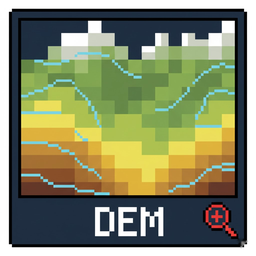 DEM 생성 (Generate DEM)
- 등고선·표고점·3D 포인트에서 `TIN - Linear`, `TIN - Clough-Tocher`, `IDW`, `Kriging (Lite, Ordinary)`로 DEM을 만듭니다.
- 표고 필드(ELEV·표고·고도·Elevation 등)를 자동 인식하고, 필드도 3D 좌표도 없는 2D 레이어는 실행을 거부합니다(빈 DEM을 "완료"로 보고하지 않음).
- 출력 격자는 픽셀 크기의 정수배로 스냅되며, 실제 x/y 픽셀 크기가 메타데이터에 기록됩니다.
- Kriging은 측점에서 입력값을 정확히 재현합니다. 변동함수를 적합하지 않는 "Lite"이므로 `_variance.tif`는 상대적 불확실성 지도입니다.
- 수치지형도 DXF 코드 프리셋은 이 대화상자에서 DXF로 불러온 레이어에만 적용됩니다.

### 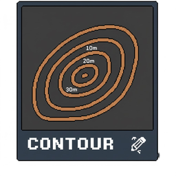 등고선 추출 (Extract Contours)
- DEM에서 `gdal_contour`로 일정 간격 등고선을 만듭니다. 결과 필드 `ELEV`는 DEM 생성 도구가 그대로 읽습니다.

### 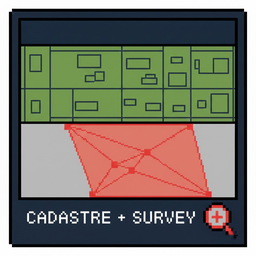 지적도 중첩 면적표 (Cadastral Overlap)
- 조사구역과 필지의 교차 면적을 `parcel_m2`, `in_aoi_m2`, `in_aoi_pct`로 기록합니다. 면적은 타원체 기준이며 지리 좌표계 입력은 경고합니다.

## 분석

### 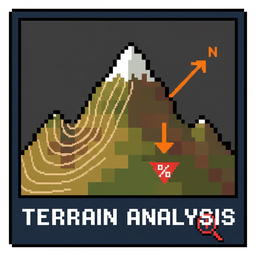 지형 분석 (Terrain Analysis)
- 경사·사면방향(Horn 1981, gdaldem), TPI와 지형 위치 6분류(Weiss 2001), TRI(Riley et al. 1999), Roughness(Wilson et al. 2007), 곡률(Zevenbergen & Thorne 1987), 사면 파생(북향성·동향성·TRASP; Roberts & Cooper 1989).
- TPI 반경 2셀 이상은 (2r+1)셀 블록 평균 근사이며 레이어 이름과 메타데이터에 실제 반경이 기록됩니다. 작은 DEM에서는 3x3으로 대체하고 그 사실을 알립니다.
- 곡률 부호: 종단 음(-)=볼록, 횡단 음(-)=수렴. GRASS·SAGA와 부호가 반대입니다.
- 경사 등급 프리셋 가운데 "한국표준"만 문헌(산림청 예규) 분류이고, 나머지 3종은 플러그인이 정한 표시 구분입니다.

### 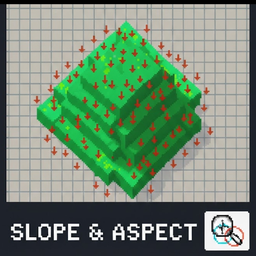 경사도/사면방향 도면화 (Slope/Aspect Drafting)
- AOI 기준 인쇄용 경사 래스터와 방위각 화살표 포인트를 만듭니다. 지리 좌표계 DEM은 거부합니다.

### 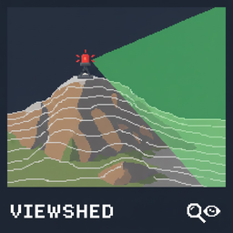 가시권 분석 (Viewshed Analysis)
- 단일·누적·가중 누적·역가시권·선형 가시권, LOS 단면, AOI 가시 통계. gdal_viewshed(Wang et al. 2000) 기반, 곡률·굴절 보정 옵션.
- 히구치 거리대의 경계(기본 500 m / 2500 m)는 실무 관례이며 히구치의 정의(D/H 비율)에 맞게 대상 높이에 따라 조정할 수 있습니다. 사용한 값은 메타데이터에 기록됩니다.

### 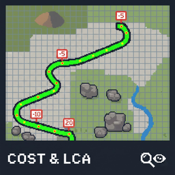 비용표면/최소비용경로 (Cost Surface / LCP)
- Tobler·Naismith·Pandolf·Herzog(Minetti) 모델과 플러그인 정의 상대 경사 비용, 추가 마찰, LCP·회랑·등시선.
- 8방향 격자 누적이라 누적 비용이 측지선 대비 최대 약 8% 과대평가될 수 있습니다(4방향은 약 41%). 절대값보다 상대 비교로 해석하십시오.
- Pandolf 시간 모드는 경사에 반응하지 않습니다. 상대 경사 비용은 기준 경사(기본 5°)에 따라 결과가 달라지므로 기준 경사를 함께 보고하십시오.

### 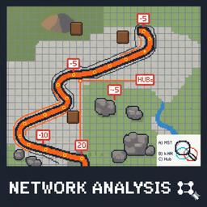 최소비용 네트워크 (Least-cost Network)
- LCP 비용으로 MST(Kruskal)·k-NN·허브 네트워크와 중심성(연결·근접·매개)을 계산합니다. 후보 간선은 유클리드 k-최근린으로 먼저 추리므로 MST는 후보 집합 위의 근사입니다.

### 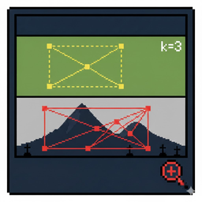 근접/가시성 네트워크 (PPA / Visibility)
- PPA: k-NN·반경·Delaunay·Gabriel·RNG. 좌표가 같은 유적은 간선을 공유합니다.
- 가시성: DEM 샘플링 LOS에 곡률·굴절 보정(기본 굴절계수 0.13). DEM NoData로 검사하지 못한 쌍은 "샘플 실패"로 세고 노드의 `fail_deg`에 기록합니다. `betweenness`는 원시 쌍 개수, `betw_norm`은 정규화값입니다.

###  거리 래스터 (Distance to Features)
- 대상 피처를 굽고(선·면은 닿는 셀 모두) 셀별 최근접 거리를 계산합니다. 대상 셀이 없거나 기준 픽셀이 정사각이 아니면 거부합니다.

### 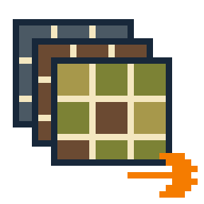 분석 결과 정렬/내보내기 (Align & Export Stack)
- 결과 래스터를 하나의 기준 격자(CRS·범위·픽셀)로 정렬해 실행별 스택과 manifest로 내보냅니다. 범주형과 방향(사면방향) 변수는 최근접, 연속형은 이중선형. NoData는 래스터별로 manifest `nodata` 열에 기록됩니다.
- 메타데이터가 없는 래스터는 `categorical=unknown`으로 표시되며, 정수형에 값 종류가 적으면 최근접으로 처리합니다. 유효 픽셀 비율(`valid_pct`)이 함께 기록됩니다.

###  변수 상관/VIF 리포트 (Correlation & VIF)
- 상관행렬과 VIF를 계산합니다. 임계값 5·10은 참고선입니다(O'Brien 2007).

### 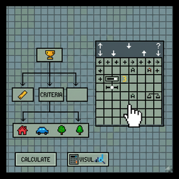 AHP 입지적합도 (AHP Suitability)
- 쌍대비교(Saaty 1980) 가중치, 일관성비율, 계층형 AHP. 계층 모드에서는 전역가중치가 실제 계산에 쓰이며 메타데이터의 `weights_source`에 기록됩니다. 자세한 사용법은 [AHP_GUIDE.md](AHP_GUIDE.md).

### 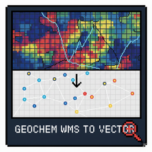 지질도 도엽 ZIP (KIGAM)
- ZIP 해제, SHP 로드, 스타일·라벨 적용, 지질 코드의 정수 래스터 변환. 코드표는 실행 전체에서 하나로 통일되고 `*_mapping.csv`에 셀 수(`cell_count`)와 함께 저장됩니다. 셀보다 좁은 암체는 경고로 표시됩니다.

###  지구화학도 래스터 수치화 (GeoChem)
- WMS 렌더링 색상을 범례(색-값)로 역추정합니다. 범례 색과 먼 픽셀은 NoData로 제외되고 비율이 경고로 표시됩니다. 구역 통계는 픽셀 중심 규칙이며 `zone_area`와 비교할 수 있습니다. 값은 추정값입니다.

### 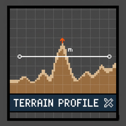 지형 단면 (Terrain Profile)
- 단면선 작성·저장·재선택, 다중 프로파일, 지도-차트 연동, AOI 음영, CSV·이미지 내보내기.

## 조사 설계·도면화·보고

###  트렌치 후보 제안 (Trench Suggestion)
- AOI 안에서 폭·길이·개수·간격·내부 포함비율 조건으로 후보를 만들고 AOI 전체에 분산 배치합니다. `rank`는 점수순, `pick_order`는 배치 순서입니다. 무덤 회피는 수치지형도 속성과 범례 어휘에 의존하므로 "대상 0건"이 무덤이 없다는 뜻은 아닙니다. 학술 방법이 아닌 조사 보조 규칙입니다.

### 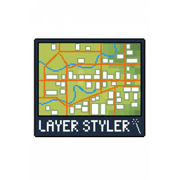 도면 시각화 (Map Styling)
- 수치지형도 DXF 레이어를 도로·하천·건물 중심으로 분류 스타일링, DEM 배경(hillshade·gray·color), QML·JSON 프리셋 내보내기.

###  AI 조사요약 (AOI Report)
- AOI 반경 내 레이어를 스캔해 로컬 요약 또는 Gemini 초안을 만듭니다. 스캔 한도·표본 비율·절단 여부가 CSV와 프롬프트에 기록되고, 잘린 응답은 표시됩니다. Gemini 모드는 AOI 정보와 레이어 통계, 유적 거리·방위를 Google 서버로 보냅니다. 민감한 유적 위치는 사전 검토 없이 보내지 마십시오.

## 해석 주의

- 가시권·LOS·비용·네트워크 결과는 DEM 해상도·CRS·고도 품질에 크게 의존합니다.
- 비용표면과 네트워크는 경사 기반 이동비용 모델입니다. 도로·식생·토지피복은 추가 마찰로 근사할 뿐입니다.
- 최소비용경로는 실제 옛길의 증거가 아니라 가설입니다. 가시권은 지형만 고려한 결과입니다.
- 화면의 등급 구간은 대부분 플러그인의 표시 관례입니다. 원저자 분류로 보고하려면 도움말의 안내를 따르십시오.
- Kriging (Lite)의 분산 래스터는 보정된 예측분산이 아닙니다.
- 지구화학도 값은 원자료가 아니라 색상에서 역추정한 추정값입니다.
- AHP 적합도는 기준·정규화·가중치에 따라 달라지는 상대지표입니다.
- 트렌치 후보 제안은 유구 존재를 보장하지 않습니다.
- 지적도 결과는 참고용이며 법적 효력이 없습니다.
- AI 조사요약 결과는 초안입니다. 최종 해석은 사용자가 검토해야 합니다.
